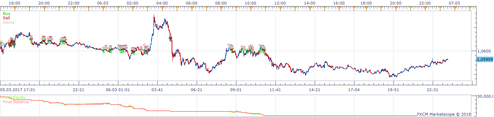
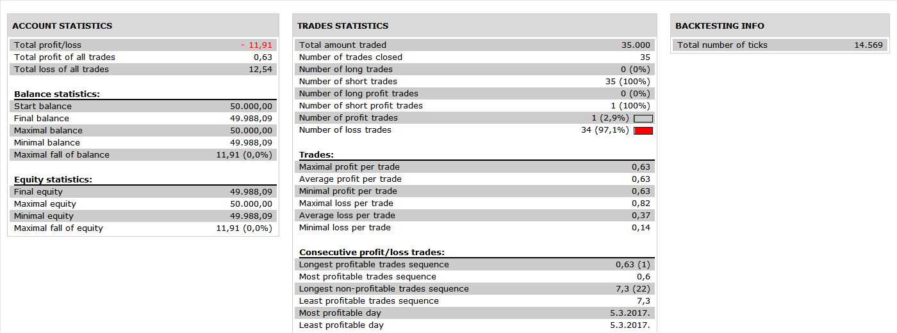

# VWAP Stratagy

> Source: https://fxcodebase.com/code/viewtopic.php?f=31&t=66167  
> Forum: 31 · Topic 66167 · 31 post(s)

---

## VWAP Stratagy

**Apprentice** · Sat Jun 02, 2018 7:12 am

 

VWAP.lua is available here.
[viewtopic.php?f=17&t=65661](https://fxcodebase.com/code/viewtopic.php?f=17&t=65661)

Open Long
Price VWAP Line Cross Over
Stop set at candle low

Vice versa for Short

 [VWAP Stratagy.lua](files/119450/VWAP%20Stratagy.lua)

---

## Re: VWAP Stratagy

**ANTONIO** · Tue Jun 05, 2018 4:53 am

Hi apprentice,

I use strategy with VWAP daily in timeframe 15.
I’m also watching the indicator VWAP (daily) on the chart and I see that the strategy opens trades either buying or selling while the indicator is a long way from the price.
For example, it opens from the strategy a selling trade as the price to cross the indicator downwards, while on the chart the VWAP (daily) is 25 pips away from the current price.
 Can you check it please?

---

## Re: VWAP Stratagy

**ANTONIO** · Fri Jun 15, 2018 9:48 am

Hi
apprentice,
Another observation is that the strategy works only with the parameter ‘’ daily’’ and the parameters ‘’weekly and monthly’’ does not work.

---

## Re: VWAP Stratagy

**ANTONIO** · Fri Jul 13, 2018 4:50 am

Hi apprentice,

Can we make a change to the strategy and add a moving average?
That is, if EMA cross above the VWAP daily to open a buy trade and if it cross down the VWAP daily to open a sale trade.

Thank you

---

## Re: VWAP Stratagy

**Apprentice** · Sat Aug 04, 2018 7:05 am

Your request is added to the development list under Id Number 4212

---

## Re: VWAP Stratagy

**Apprentice** · Mon Aug 06, 2018 9:22 am

Try this version.

 [VWAP Stratagy.ANTONIO.lua](files/120348/VWAP%20Stratagy.ANTONIO.lua)

---

## Re: VWAP Stratagy

**MC. Trend Trader** · Tue Aug 07, 2018 6:58 am

Hello,
I request of opening multi positions at the same time with different lot sizes, stops & limits for the VWAP Strategy.

paramaters should be jncluded:

Open trade 1: Yes/No
Trade 1: lot size
Set Limit for Trade 1: Yes/No’
Limit for Trade1, in pips 30
Set Stop for Trade 1 ‘Yes/No’
Stop for Trade 1: 30
Trailing Stop order for Trade 1: ‘Yes/No’
Trailing for Trade 1, in pips 10
Breakeaven for Trade 1: ‘Yes/No’
Min Profit for Trade1 10

The Trade 1 Logic be repeated for a total of 5 positions

Best regards

---

## Re: VWAP Stratagy

**MC. Trend Trader** · Tue Aug 07, 2018 7:01 am

Hello,
I request of opening multi positions at the same time with different lot sizes, stops & limits for the VWAP Antonio Strategy.

paramaters should be jncluded:

Open trade 1: Yes/No
Trade 1: lot size
Set Limit for Trade 1: Yes/No’
Limit for Trade1, in pips 30
Set Stop for Trade 1 ‘Yes/No’
Stop for Trade 1: 30
Trailing Stop order for Trade 1: ‘Yes/No’
Trailing for Trade 1, in pips 10
Breakeaven for Trade 1: ‘Yes/No’
Min Profit for Trade1 10

The Trade 1 Logic be repeated for a total of 5 positions

Best regards

---

## Re: VWAP Stratagy

**Apprentice** · Tue Aug 07, 2018 8:46 am

Your request is added to the development list under Id Number 4218

---

## Re: VWAP Stratagy

**Apprentice** · Wed Aug 08, 2018 3:52 am

Try this version.

 [VWAP Stratagy.MC_Trend_Trader.lua](files/120437/VWAP%20Stratagy.MC_Trend_Trader.lua)

---

## Re: VWAP Stratagy

**MC. Trend Trader** · Thu Aug 09, 2018 7:35 am

Thank you for your prompt reply.

Unfortunately, the limit pips are accepted as stop prices when the position is opened and no limitpips are accepted.

Best regards

---

## Re: VWAP Stratagy

**Apprentice** · Sun Aug 12, 2018 3:50 am

Fixed typo.

---

## Re: VWAP Stratagy

**ANTONIO** · Wed Oct 03, 2018 4:40 am

Hi apprentice,

There is a problem (probably with windows 10) with the strategies: VWAP Strategy.ANTONIO.lua and VWAP Strategy.MC_Trend_Trader.lua, they doesn’t work.

It appears all the time the message: “C:/Program Files (x86)/Candleworks/FXTS2/Strategies/Custom/VWAP Strategy.ANTONIO.lua:219:Please, download and install VWAP.LUA indicator”. I try it many times but the problem still exist.

Also, the VWAP daily appears to work differently in strategy than how shown the movement in the chart.

Can you check it?

Thank you

---

## Re: VWAP Stratagy

**Apprentice** · Wed Oct 03, 2018 5:23 am

I use windows 10, I use this strategy without any problem.
1. Try to add VWAP to your chart.
2. DO NOT rename the indicator

---

## Re: VWAP Stratagy

**ANTONIO** · Wed Oct 03, 2018 5:51 am

I have try this a lot of times and the problem still exist.

---

## Re: VWAP Stratagy

**ANTONIO** · Wed Oct 03, 2018 6:15 am

Ok, I restart and the problem was resolved and the strategy is now active.

About the function of indication vwap in the strategy, do you have any comment?
For example, the strategy opens a sales trade, while on the chart I see that the vwap is in a completely different position.
Thank you

---

## Re: VWAP Stratagy

**ANTONIO** · Tue Feb 26, 2019 5:00 am

Hi apprentice,

There is a problem with the strategies: VWAP Strategy.ANTONIO.lua and
VWAP Strategy.MC_Trend_Trader.lua.
Strategies work by counting only VWAP Daily.
Either I choose VWAP weekly or VWAP monthly, strategies only calculate VWAP Daily.

Can you check it please?
Thank you.

---

## Re: VWAP Stratagy

**Apprentice** · Tue Mar 05, 2019 5:58 am

Try it now.

---

## Re: VWAP Stratagy

**ANTONIO** · Tue Mar 05, 2019 11:59 am

Does not work

---

## Re: VWAP Stratagy

**ANTONIO** · Wed Mar 06, 2019 6:35 am

and the following message appears…

C:/Program Files(x86)/Candleworks/FXTS2/Strategies/Custom/VWAPStratagy.ANTONIO.lua:387: attempt to index upvalue 'stream' (a nil value)

---

## Re: VWAP Stratagy

**ANTONIO** · Thu Mar 07, 2019 6:28 am

It doesn’t work and it appears the following message
C:/Program Files(x86)/Candleworks/FXTS2/Strategies/Custom/VWAPStratagy.ANTONIO.lua:387: attempt to index upvalue ‘stream’ (a nil value)

---

## Re: VWAP Stratagy

**Apprentice** · Mon Apr 01, 2019 10:21 am

Try it now.
Have fixed it myself.

---

## Re: VWAP Stratagy

**ANTONIO** · Tue Apr 02, 2019 6:49 am

Hi apprentice,
Now it appears the following message:

C:/Program Files(x86)/Candleworks/FXTS2/Strategies/Custom/VWAPStratagy.ANTONIO.lua:364: C:/Program Files(x86)/Candleworks/FXTS2/Indicators/Custom/VWAP.lua (163,-1): E19 - attempt to index field ‘?’ (a number value)

---

## Re: VWAP Stratagy

**ANTONIO** · Thu May 02, 2019 8:09 am

Hi Apprentice,

Can you see it?

Thank you

---

## Re: VWAP Stratagy

**Apprentice** · Wed May 22, 2019 2:24 am

I need your VWAP. I have several versions of it and none of them do have something meaningful on the line with the error. Screenshot of parameters used will help.

---

## Re: VWAP Stratagy

**ANTONIO** · Tue Jun 04, 2019 4:57 am

Hi Apprentice,
and VWAPStratagy.ANTONIO and VWAP Strategy.MC_Trend Trader do not work right.

I attach the VWAP indicator that i use and the parameters.

Thank you.

---

## Re: VWAP Stratagy

**Apprentice** · Sun Jun 30, 2019 6:14 pm

> and VWAPStratagy.ANTONIO and VWAP Strategy.MC_Trend Trader do not work right.

Can you specify?

---

## Re: VWAP Stratagy

**ANTONIO** · Mon Jul 01, 2019 3:50 am

Hi apprentice,

Both of strategies do not operate with the VWAP indicator i have attached above.
Probably they use different version of VWAP indicator.
Can you add the VWAP indicator, which i attached?

Thank you

---

## Re: VWAP Stratagy

**ANTONIO** · Tue Jul 16, 2019 10:09 am

Hello,

The VWAP indicator that I had attached, I found it to this site,
link: "http://fxcodebase.com/code/viewtopic.php?f=17&t=65661"

---

## Re: VWAP Stratagy

**Apprentice** · Mon Jul 29, 2019 6:41 am

These strategies use VWAP indicator (whatever installed under this name in your FXTS2)

---

## Re: VWAP Stratagy

**Adamkek** · Mon Jul 29, 2019 9:05 am

Hello! I think that you are right and they probably use a different version of VWAP indicator. You can visit any of the top website for forex trading in order to check if they can provide you with such an indicator. I think that every support team can help you in a moment.
