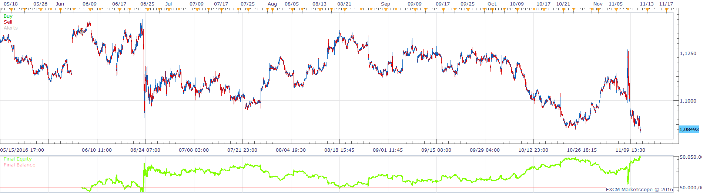
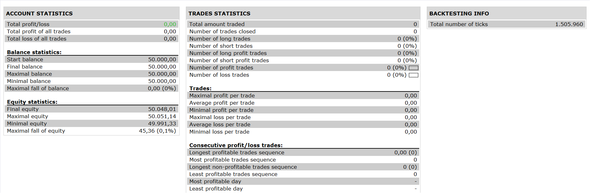

# WADDAH ATTAR ATR TS STRATEGY

> Source: https://fxcodebase.com/code/viewtopic.php?f=31&t=64104  
> Forum: 31 · Topic 64104 · 7 post(s)

---

## WADDAH ATTAR ATR TS STRATEGY

**Apprentice** · Wed Nov 16, 2016 7:52 am

 

BUY:
TG>BUY LEVEL AND TG<E AND TR=0 IN WATTAH ATTAR EXPLOSION INDICATOR OF H4 AND
PRICE CROSS OVER ATRTS IN M15

SELL:
TR>SELL LEVEL AND TR<E AND TG =0 IN WATTAH ATTAR EXPLOSION INDICATOR OF H4 AND
PRICE CROSS UNDER ATRTS IN M15

 [WADDAH ATTAR ATR TS STRATEGY.lua](files/109102/WADDAH%20ATTAR%20ATR%20TS%20STRATEGY.lua)

ATR TS INDICATOR
[viewtopic.php?f=17&t=1434&hilit=atr+sl](https://fxcodebase.com/code/viewtopic.php?f=17&t=1434&hilit=atr+sl)
WATTAH ATTAR EXPLOSION INDICATOR
[viewtopic.php?f=17&t=1011](https://fxcodebase.com/code/viewtopic.php?f=17&t=1011)

The Strategy was revised and updated on December 11, 2018.

---

## Re: WADDAH ATTAR ATR TS STRATEGY

**jaricarr** · Tue Dec 06, 2016 11:40 pm

Hi Apprentice,

Can you explain what are the Sell/Buy levels ?

The indicator doesn't have those levels therefore cant figure it out.

---

## Re: WADDAH ATTAR ATR TS STRATEGY

**Apprentice** · Wed Dec 07, 2016 3:12 am

Is a required by the user.

---

## Re: WADDAH ATTAR ATR TS STRATEGY

**jaricarr** · Wed Dec 07, 2016 10:13 pm

ah ok.
Can it be incorporated to the WAE indicator please ?

---

## Re: WADDAH ATTAR ATR TS STRATEGY

**Apprentice** · Thu Dec 08, 2016 2:50 pm

You mean WAEO.lua?
Can you provide the rules?

---

## Re: WADDAH ATTAR ATR TS STRATEGY

**jaricarr** · Sun Dec 11, 2016 6:42 pm

yes, i meant WAEO and does ("TG", "E" and "TR") mean ?

Can you please add this exit parameter ?

EXIT BUY: Price crosses under the ATR TS (in 4H TF)
EXIT SELL: Price Crosses over the ATR TS (in 4H TF)

BUY:
TG>BUY LEVEL AND TG<E AND TR=0 IN WATTAH ATTAR EXPLOSION INDICATOR OF H4 AND
PRICE CROSS OVER ATRTS IN M15

SELL:
TR>SELL LEVEL AND TR<E AND TG =0 IN WATTAH ATTAR EXPLOSION INDICATOR OF H4 AND
PRICE CROSS UNDER ATRTS IN M15

---

## Re: WADDAH ATTAR ATR TS STRATEGY

**Apprentice** · Mon Dec 12, 2016 3:38 pm

Your request is added to the development list, Under Id Number 3694
 If someone is interested to do this task, please contact me.
