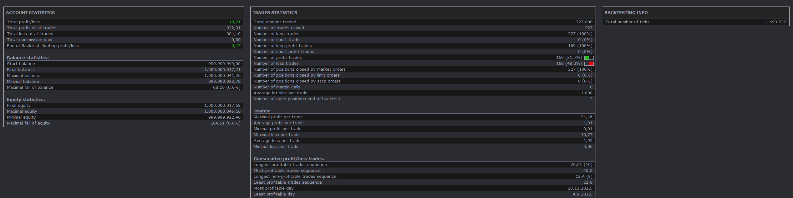

# Waddah Attar Explosion Strategy

> Source: https://fxcodebase.com/code/viewtopic.php?f=31&t=73703  
> Forum: 31 · Topic 73703 · 1 post(s)

---

## Waddah Attar Explosion Strategy

**Apprentice** · Tue May 09, 2023 11:28 am

 

Based on source
[https://www.tradingview.com/script/d9Ij ... on-V2-SHK/](https://www.tradingview.com/script/d9IjcYyS-Waddah-Attar-Explosion-V2-SHK/)

Signal for ENTER_BUY: All the following conditions must be met.
- Green histo is raising.
- Green histo above Explosion line.
- Explosion line raising.
- Both green histo and Explosion line above DeadZone line.

Signal for EXIT_BUY: Exit when green histo crosses below Explosion line.

Signal for ENTER_SELL: All the following conditions must be met.
- Red histo is raising.
- Red histo above Explosion line.
- Explosion line raising.
- Both red histo and Explosion line above DeadZone line.

Signal for EXIT_SELL: Exit when red histo crosses below Explosion line.

Please install Waddah Attar Explosion.lua
[https://fxcodebase.com/code/viewtopic.php?f=17&t=73702](https://fxcodebase.com/code/viewtopic.php?f=17&t=73702)

 [Waddah Attar Explosion Strategy.lua](files/150777/Waddah%20Attar%20Explosion%20Strategy.lua)
