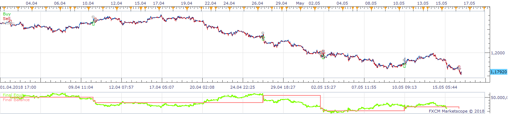
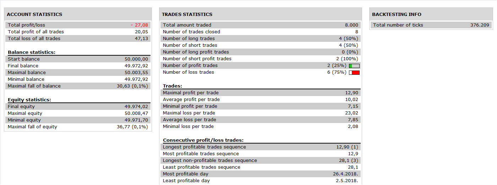

# Waddah Attar Explosion strategy

> Source: https://fxcodebase.com/code/viewtopic.php?f=31&t=3601  
> Forum: 31 · Topic 3601 · 22 post(s)

---

## Waddah Attar Explosion strategy

**Apprentice** · Sun Mar 06, 2011 4:30 am

 

 

 [Waddah Attar Explosion Strategy.lua](files/8646/Waddah%20Attar%20Explosion%20Strategy.lua)

So, do not forget to download and install the Waddah Attar's Explosion Oscillator indicator.
[viewtopic.php?f=17&t=1011](https://fxcodebase.com/code/viewtopic.php?f=17&t=1011)

---

## Re: Waddah Attar Explosion strategy

**NID007** · Tue Mar 08, 2011 1:10 am

Thanks for your hard efforts and great work,

 it seems to work better on a 1H to 4H time frames ,but you have to be sure to set your SL and TP as per any trade made by a strategy.Settings to be left as default work best I think,will keep back testing though ,see how I can get it to work somewhat ok ,thanks again

---

## Re: Waddah Attar Explosion strategy

**NID007** · Thu Mar 10, 2011 9:33 am

Hi again Apprentice ,

Is it possible to add to the Waddah Attar Explosion strategy the option Time frame tick to the stratergy so I can run it on a tick chart . It launches alot of trades for me which is what I want it to do
many thanks in advance
Nid007

---

## Re: Waddah Attar Explosion strategy

**a0007002** · Sun Mar 13, 2011 10:44 am

I am not able to get the stops and limits to work on this. I have TradeStation 01.10.010311. I've closed and reopened program, tried various time frames and values for S&L's. Can anyone else verify they are getting these to work or not work please in this version of TS.

Using these settings on EURUSD 1 hr:
Sensitivity 150
Dead Zone 30
Explosion Power 15
Trend Power 31

Produce nice results from 5/2010 to 3/11/2011 using 10K lot but they could be nicer if the S&L's worked. Right now it seems to only be workable using signal direction change to open/close trades.

Good useful strat and indicator and would like to use this more often if can get the EA to perform fully

---

## Re: Waddah Attar Explosion strategy

**NID007** · Mon Mar 14, 2011 5:39 pm

please can anyone tell me is there any strategies that , trade long and short that work on a tick chart (T frame setting) ,if so please can you tell me which one they are.

Also please can we get the new Wadda Attah explosion strategy by apprentice ,which is great work ,,to work on a tick (T) setting that would be even better .
thanks again ,
Nid007

---

## Re: Waddah Attar Explosion strategy

**Apprentice** · Tue Mar 15, 2011 5:57 am

WADDAH ATTAR EXPLOSION Indicator Use Bar Data Source.
For this reason Tick data can not be used for this strategy.

Generally, any strategy that uses the Tick Data, Not Bar data source,
can use Tick Data.

But in most cases this is not possible or supported .

---

## Re: Waddah Attar Explosion strategy

**Caalador** · Tue Mar 15, 2011 2:18 pm

hmm, I'm getting an error that says "unsupported" when I try to backtest it (only happens when allow trade is on).

It's on line 133 of your strategy. It's on a demo account...

---

## Re: Waddah Attar Explosion strategy

**NID007** · Tue Mar 15, 2011 4:48 pm

> **Apprentice wrote:**
> WADDAH ATTAR EXPLOSION Indicator Use Bar Data Source.
> For this reason Tick data can not be used for this strategy.
>
> Generally, any strategy that uses the Tick Data, Not Bar data source,
> can use Tick Data.
>
> But in most cases this is not possible or supported .

Hi apprentice ,thanks for your detailed response .

Ive tried the WAE indicator itself on a tick chart it works vey well ,why does'nt the strategy launch trades based on that ?
If its the case its not supported can you build it to be supported, and use Tick data .

Thanks Nid007
PS do you have any strategies on this site , that work on Tick chart ? thanks Apprentice in advance

---

## Re: Waddah Attar Explosion strategy

**Apprentice** · Wed Mar 16, 2011 4:44 am

To Caalador
I believe this is the result of a bug in the latest official version.
If you restart application after installation of strategy.
Everything should be ok.

---

## Re: Waddah Attar Explosion strategy

**Apprentice** · Wed Mar 16, 2011 4:46 am

To Nid007
I do not have this information.
I would have to review each individual strategy.

---

## Re: Waddah Attar Explosion strategy

**NID007** · Wed Mar 16, 2011 7:30 am

> **Apprentice wrote:**
> To Nid007
> I do not have this information.
> I would have to review each individual strategy.

Hi apprentice ,thanks for your response .

Can you please answer the following ;

Ive tried the WAE indicator itself on a tick chart it works vey well ,why does'nt the strategy launch trades based on that ?
If its the case its not supported can you build it to be supported, and use Tick data .

Also can you get the RLW strategy to work on Tick Chart (tick data) that would be most appreciated
thanks
Nid007

---

## Re: Waddah Attar Explosion strategy on tick?

**NID007** · Wed Apr 06, 2011 1:18 pm

Hello Sunshine

I ve seen that you have successfully modified strategies i.e. RLW , MA Cross etc ,to work on a tick chart , my best and favourite strategy is the Waddah Attah Explosion strategy ,which i would like to see it working on a tick data, the indicator file works and looks great on a tick chart ,please can we ammend it ti work on a tick ,many thanks for your help
Nid007

Strategy file here
[viewtopic.php?f=31&t=3601&hilit=waddah](https://fxcodebase.com/code/viewtopic.php?f=31&t=3601&hilit=waddah)

Indicator here ,need to install to work strategy
[viewtopic.php?f=17&t=1011](https://fxcodebase.com/code/viewtopic.php?f=17&t=1011)

---

## Re: Waddah Attar Explosion strategy

**sunshine** · Fri Apr 08, 2011 3:32 am

Hi NID007,

Please find the tick version of the indicator and strategy in the attachment.
If you have any questions, do not hesitate to contact me anytime.

Download strategy:

 [Waddah Attar Explosion Strategy Tick.lua](files/9493/Waddah%20Attar%20Explosion%20Strategy%20Tick.lua)

Download indicator:

 [Waddah_Attar_Explosion_Tick.lua](files/9493/Waddah_Attar_Explosion_Tick.lua)

---

## Re: Waddah Attar Explosion strategy

**NID007** · Fri Apr 08, 2011 2:45 pm

Thanks very much Sunshine ,you have done a great job ,you are truely an excellent at what you do ,I will test out the new files now,

Thanks,
Nid007

---

## Re: Waddah Attar Explosion strategy

**NID007** · Sat Apr 09, 2011 3:49 pm

Hello Sunshine ,

I have been testing the WAE out on tick and it launches trades frequently.

I have also tested the non tick WAE file by Apprentice again out on a 1 min frame and what I have found is that the point of entry when it trades long or short is 2 bars to late getting in , or enters trades 2 candles too late ,so sometimes cant clear the spread and gain 1-2 pips, misses the trade all together, it would be good if it launches a trade on the tick up of the explosion line or the immediate trend bar after the explosion upwards happenes.

Is this possible to adjust the setting or recode slightly please advise as this EA would work much better. please try it on the non tick WAE Stratagy file first ,so I can test it on a 1min frame ,5 frame etc .

thanks again Sunshine for you hard efforts

NId007

---

## Re: Waddah Attar Explosion strategy

**NID007** · Tue Apr 12, 2011 3:57 pm

Hello again Sunshine

Just another addition to my last message , thought I would send you the trading rules for the Waddah Attah Explosion strategy (non tick strategy version for now please ) if you could check it is coded to trade these rules and if not please code it correctly ,that would be great ,

thank you

Reference the indicator to see my explaination below.

BUY ENTRY RULES:
when green BAR goes up and yellow line(explosionline) goes up and green BAR is higher than yellow line and all is higher than the dead zone line. BUY

BUY EXIT RULES
1.when green bar is below yellow line(explosionline) no matter the order is in profit or loss.

SELL ENTRY RULES
when red BAR goes up and yellow line(explosionline) goes up and red BAR is higher than yellow line and all is higher than the dead zone line. SELL

SELL EXIT RULES
1.when red bar is below yellow line(explosionline) no matter the order is in profit or loss.

General Exit rules:
1.TakeProfit
2.StopLoss

OTHER REQUESTS:
1.TRADE TIME SETS(GMT) FROM 6:00 TO 18:00

---

## Re: Waddah Attar Explosion strategy

**sunshine** · Wed Apr 13, 2011 3:51 am

Hi,

As I see, Apprentice's strategy trades by the following conditions.

**BUY condition**

The following conditions should met to enter LONG and exit SHORT:

1. Current bar of Waddah Attar's Explosion Oscillator is green
2. green bar > explosion
3. green bar, explosion > DeadZone
4. explosion line goes up (compared with the value in the previous period. That is the following condition is met: "explosion(cur.period) > explosion(prev.period)")
5. green bar goes up (compared with the value which was 2 periods ago. That is the following condition is met: "Waddah bar(cur.period) > Waddah bar (cur.period-2)")
6. Prev. signal is not "BUY"
7. TrendPower >= TrendPower(default), where:
TrendPower(default) is the value of the strategy parameter "Trend Power" ("15" by default)
TrendPower = 100 * (Waddah bar(curr.period) - Waddah bar(curr.period-2))/Waddah bar(curr.period)
8. ExplosionPower >= ExplosionPower(default), where:
ExplosionPower(default) is the value of the strategy parameter "Explosion Power" ("15" by default)
ExplosionPower = 100 * (explosion(curr.period) - explosion(curr.period-1))/explosion(curr.period)

**SELL condition**

The following conditions should met to enter SHORT and exit LONG:

1. Current bar of Waddah Attar's Explosion Oscillator is red
2. red bar > explosion
3. red bar, explosion > DeadZone
4. explosion line goes up (compared with the value in the previous period. That is the following condition is met: "explosion(cur.period) > explosion(prev.period)")
5. red bar goes up (compared with the value which was 2 periods ago. That is the following condition is met: "Waddah bar(cur.period) > Waddah bar (cur.period-2)")
6. Prev. signal is not "SELL"
7. TrendPower >= TrendPower(default), where:
TrendPower(default) is the value of the strategy parameter "Trend Power" ("15" by default)
TrendPower = 100 * (Waddah bar(curr.period) - Waddah bar(curr.period-2))/Waddah bar(curr.period)
8. ExplosionPower >= ExplosionPower(default), where:
ExplosionPower(default) is the value of the strategy parameter "Explosion Power" ("15" by default)
ExplosionPower = 100 * (explosion(curr.period) - explosion(curr.period-1))/explosion(curr.period)

If I understand you correctly, the conditions for exiting Long/Short should be modified.
Do you want to modify conditions for entering Long/Short as well?

---

## Re: Waddah Attar Explosion strategy

**NID007** · Wed Apr 13, 2011 6:22 am

Hello Sunshine

Yes please, if we can modify the enter long and short ,and the exit long and short it would work much better ,because it enters the trade 2 bars too late and the exit strategy doesnt work at all ,so many thanks for your speedy reply and help on this matter .
To be clear ,I am referring to the WAE strategy lua file that works on a, 1 min frame, 5min ,15min etc .I also emailed you the rules with a diagam ,any further quetions please ask ,
thank you for your time Sunshine ,
much appreciated ,
Nid007

---

## Re: Waddah Attar Explosion strategy

**sunshine** · Wed May 04, 2011 6:15 am

The new version of the Waddah Attar Explosion strategy. In accordance with NID007 request:

BUY ENTRY RULES:
when green BAR goes up and yellow line(explosionline) goes up and green BAR is higher than yellow line and all is higher than the dead zone line. BUY

BUY EXIT RULES
1.when green bar is below yellow line(explosionline) no matter the order is in profit or loss.

SELL ENTRY RULES
when red BAR goes up and yellow line(explosionline) goes up and red BAR is higher than yellow line and all is higher than the dead zone line. SELL

SELL EXIT RULES
1.when red bar is below yellow line(explosionline) no matter the order is in profit or loss.

---

## Re: Waddah Attar Explosion strategy

**NID007** · Wed May 04, 2011 10:12 am

Thank you very much ,Sunshine
you have done another great job highly apprecaited ,it works well and on a 30 min frame is best

Kind regards
Nid007

---

## Re: Waddah Attar Explosion strategy

**Apprentice** · Wed Nov 30, 2016 5:43 am

Bump up.

---

## Re: Waddah Attar Explosion strategy

**Apprentice** · Sat Nov 17, 2018 10:05 am

The Strategy was revised and updated on November 17. 2018.
