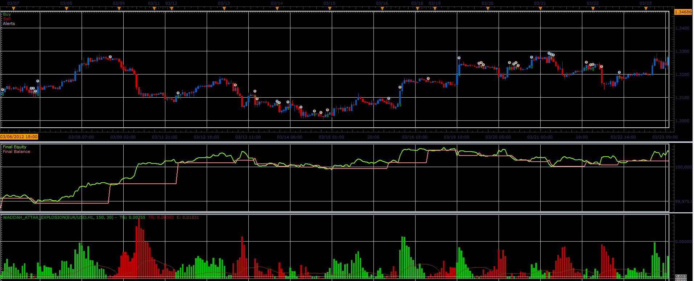

# Waddah Attar's Explosion strategy

> Source: https://fxcodebase.com/code/viewtopic.php?f=31&t=20168  
> Forum: 31 · Topic 20168 · 3 post(s)

---

## Waddah Attar's Explosion strategy

**Alexander.Gettinger** · Wed Jun 13, 2012 9:06 am

The strategy based on Waddah Attar's Explosion oscillator ([viewtopic.php?f=17&t=1011&p=8630](https://fxcodebase.com/code/viewtopic.php?f=17&t=1011&p=8630)).

 

Download strategy:
[viewtopic.php?f=17&t=1011&p=8630](https://fxcodebase.com/code/viewtopic.php?f=17&t=1011&p=8630)

For this strategy must be installed Waddah Attar's Explosion oscillator ([viewtopic.php?f=17&t=1011&p=8630](https://fxcodebase.com/code/viewtopic.php?f=17&t=1011&p=8630)).

---

## Re: Waddah Attar's Explosion strategy

**Steven_1974** · Wed Sep 05, 2012 5:01 pm

I have the strategy active after I ran it through some optimization. Is anyone else having trouble with it setting a stop and a trailing stop when it automatically places orders? It is placing the order for me, but stops and such are not added to it.

---

## Re: Waddah Attar's Explosion strategy

**Apprentice** · Mon Dec 05, 2016 9:55 am

Bump up.
