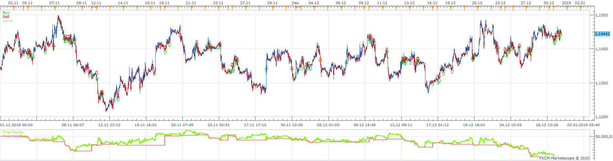
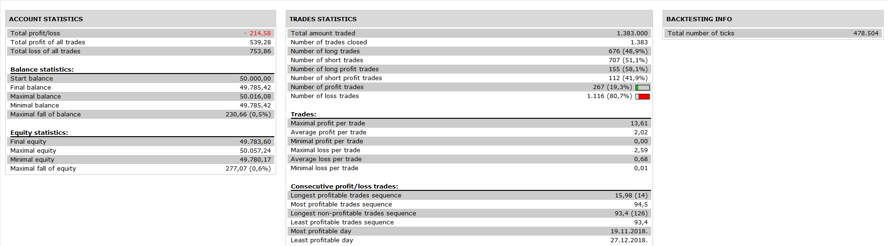

# Weekly_VWAP_strategy

> Source: https://fxcodebase.com/code/viewtopic.php?f=31&t=69356  
> Forum: 31 · Topic 69356 · 7 post(s)

---

## Weekly_VWAP_strategy

**Apprentice** · Tue Jan 28, 2020 2:09 pm

 

Based on Weekly_VWAP.lua
[viewtopic.php?f=17&t=69055](https://fxcodebase.com/code/viewtopic.php?f=17&t=69055)

 [Weekly_VWAP_strategy.lua](files/130952/Weekly_VWAP_strategy.lua)

---

## Re: Weekly_VWAP_strategy

**AEKARAOLE** · Tue Jan 28, 2020 4:17 pm

Hi apprentice,

THERE IS NO ALERT (EMAILS) FOR OPENING THE TRADES (IMPORTANT)
AND THERE IS NO TRAILING STOP

Thank you

---

## Re: Weekly_VWAP_strategy

**Apprentice** · Wed Jan 29, 2020 5:31 pm

Your request is added to the development list.
Development reference 612.

---

## Re: Weekly_VWAP_strategy

**Apprentice** · Thu Jan 30, 2020 5:18 pm

Try it now.

---

## Re: Weekly_VWAP_strategy

**AEKARAOLE** · Tue Feb 18, 2020 4:51 am

Hi apprentice,
Can you add to the strategy the following options:
Position Cap
Max. of open positions

Thank you.

---

## Re: Weekly_VWAP_strategy

**Apprentice** · Tue Feb 18, 2020 8:59 am

Your request is added to the development list.
Development reference 739.

---

## Re: Weekly_VWAP_strategy

**Apprentice** · Wed Feb 19, 2020 2:31 pm

Try it now.
