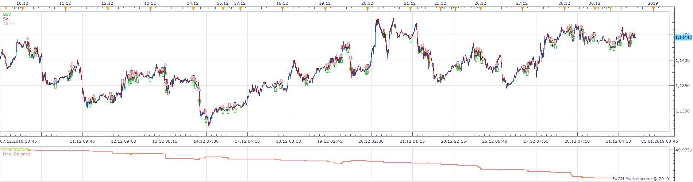
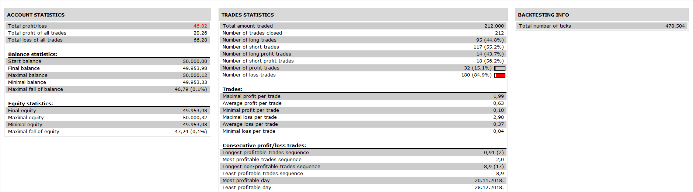

# william17_strategy

> Source: https://fxcodebase.com/code/viewtopic.php?f=31&t=69078  
> Forum: 31 · Topic 69078 · 8 post(s)

---

## william17_strategy

**Apprentice** · Fri Nov 01, 2019 7:29 am

 

Based on request.
[viewtopic.php?f=27&t=68927](https://fxcodebase.com/code/viewtopic.php?f=27&t=68927)

 [william17_strategy.lua](files/129522/william17_strategy.lua)

---

## Re: william17_strategy

**william17** · Mon Nov 04, 2019 6:38 pm

Hello Apprentice,

thank you for your work,
But we have a problem with the open position with SAR,
The change SAR UP / SAR DOWN is not respected

So, it is possible to replace by the following idea:
enterLongAction.IsPass = function (source, period, periodFromLast, data)
 return source.close[period] > SAR.DOWN:hasData(period)
 and source.close[period - 1] < SAR.UP:hasData(period - 1)
 and source.close[period] > Ichimoku.SA[period]
 and source.close[period] > Ichimoku.SB[period]
 and RSI.DATA[period - 1] < rsi_entry_level;
 and ADX.DATA[period] > 25;
 end

And
enterShortAction.IsPass = function (source, period, periodFromLast, data)
 return source.close[period] < SAR.UP:hasData(period)
 and source.close[period - 1] > SAR.DOWN:hasData(period - 1)
 and source.close[period] < Ichimoku.SA[period]
 and source.close[period] < Ichimoku.SB[period]
 and RSI.DATA[period - 1] > rsi_entry_level;
 and ADX.DATA[period] > 25;
 end

As you can see, i have add the ADX indicators,
And for information, here are my settings in upload attachement,

Thank you for your help,

---

## Re: william17_strategy

**william17** · Wed Nov 13, 2019 7:43 am

Hello Apprentice,

Ok may be you can't help about my last post,
It doesn't matter,

But i have a problem with your algorithm,
Indeed, when i load it in Notepad++ to do some changes, and when i save it, this saved file dosen't appear in the custom files strategy!!??

Have you an idea please?

---

## Re: william17_strategy

**Apprentice** · Wed Nov 13, 2019 3:37 pm

1. Request
Your request is added to the development list.
Development reference 313.
2. Request
Without access to your modifications, I won't be able to help you.

---

## Re: william17_strategy

**william17** · Wed Nov 13, 2019 6:04 pm

Thank you for your reply and for the first request

And for the second request, my modifications are only the formule to open a trade (with one indicator added, ADX)

So to explain that well, here in uploaded files,
 the first file on which i have worked on (your file, namely "william17_strategy"),
 and the second file on which i have made some changes (namely "william1_strategy")

I will be very happy if you could tell me why when i save it with notepad++ after it doesn't appear in the custom file strategy of marketscope…

Thany you very much

---

## Re: william17_strategy

**Apprentice** · Thu Nov 14, 2019 11:25 am

1. Use of adx_period instead of ADX_N parameter
2. ";" symbol in an inappropriate place (use VScode with Indicore extension installed, it'll highlight such errors)
3. source.close[period] > SAR.DOWN:hasData(period) This is incorrect as well. SAR does have DN and UP streams. You are using DOWN. hasData checks whether there is value in DN stream (DN stream has a value when SAR below the price).

---

## Re: william17_strategy

**william17** · Fri Nov 15, 2019 11:58 am

Thank you very much for your clarification,

So i did some tests…
Some parts works well, and others no...
Focusing only on the change of SAR indicator, how we can write the formule to have a good work?

Because even with your first version, the open positions don't follow the change of SAR…

Could you help me on this point please?

---

## Re: william17_strategy

**william17** · Thu Nov 21, 2019 12:32 pm

Hello Apprentice,

I would like to know if you have a solution to make work well the change SAR UP / SAR DOWN…

I have done several tests, i can't do it ?

Yet, i have tried several things, but without success…

Know you how we can use the change SAR UP / SAR DOWN (and only that) to have a good work ?

Thank you
