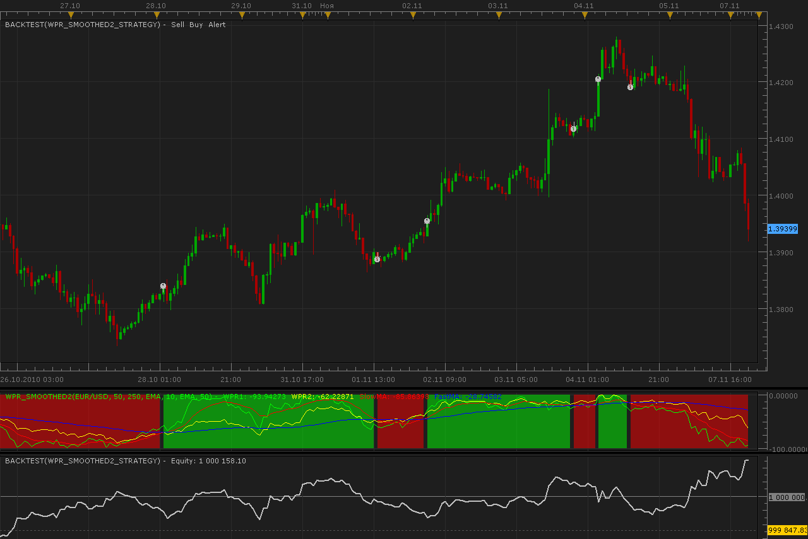

# WPR Smoothed strategy

> Source: https://fxcodebase.com/code/viewtopic.php?f=31&t=2618  
> Forum: 31 · Topic 2618 · 5 post(s)

---

## WPR Smoothed strategy

**Alexander.Gettinger** · Mon Nov 08, 2010 2:35 am

This strategy based on WPR Smoothed indicator: [viewtopic.php?f=17&t=2579](https://fxcodebase.com/code/viewtopic.php?f=17&t=2579)

 

For this strategy must be installed indicator PR_Smoothed2.lua from [viewtopic.php?f=17&t=2579](https://fxcodebase.com/code/viewtopic.php?f=17&t=2579)

The Strategy was revised and updated on November 21, 2018.

---

## Re: WPR Smoothed strategy

**Coondawg71** · Wed Nov 30, 2011 11:27 am

In supplement of prior post...AND in conjunction with the post by DWetherell...

Keep in mind this all gears around SHORT TERM trading usage (5min, 15min chart time frames) considering I personally did not change any default parameters other than the slow and fast moving average methods. Longer term trades with these settings has not been considered as of yet for the simple reasons: 1. Market is too volatile 2. personal preference to short time frames for the sake of liquidity and reduction of capital loss.

Zero and Hull MA work well to show the beginning of the trends (heat map portion of the WPR Smoothed Indicator) due to the fact of the obvious lack of "lag". In comparison of these two averages you will see they both show earlier entries and exits on the the "heat map" portion of the WPR Smoothed Indicator and as a consequence you will see more breaks in the trend of the heat map. HULL by design will be smoother than the Zero Lag but still very sensitive to due the lack of lag. This is where the beauty of this creation, WPR Smoothed, comes to light. It is an indicator within an indicator with yet another indicator. With all of these elements comprising the WPR Smooth, you can trade in a precise fashion.

My observation is this:

1. Use the heat map as a precise signal beginning/ending of a new trend and establish respective position.

2. Use WPR1 in the case of this indicator (green line) to pinpoint my overbought/oversold points (I personally prefer more extreme points than most people{my opinion is that is allows price to catch up with with indicator and therefore more accuracy} of -10 and -90 or even -5 and -95 if I am visually trading . This is a point in a position where a trader would start to scale out of a position, possibly closing 50% for example. My preference is to close out 100%.

3. Close a position entirely when the Slow MA (red line) crosses the Fast MA (blue line) which coincides with rule #1 due to end of trend.

---

## Re: WPR Smoothed strategy

**Coondawg71** · Thu Dec 01, 2011 2:26 pm

I commend you guys for creating such a wonderful indicator in the WPR Smoothing!!!

I normally have been placing several time frames of the WPR% Indicator overlaying each other as my personal favorite of all indicators but the implementation of the WPR Smoothing makes it even better and more powerful (reasons listed in my prior post).

I would like to ask if you can add a couple more PERIODS to the WPR Smooth2 Indicator and respectfully the Strategy as well. I am enclosing an attatchment to help illustrate what the additions will show in regards to the WPR%'s portion of the WPR Smooth2. You could call this version WPR Smoothed4 after adding the 2 addition indicators periods. If you could please set the default of the four periods to 10,25,50,100. Two elements that would greatly enhance the WPR Smoothed2 Strategy would be: 1) within the Trading Parameters please add the ability to trade the buy or sell side only, like I have seen in other strategies. 2) Please allow the overbought/oversold thresholds to be adjusted by the user for EACH PERIOD.

A total compilation of all these elements would make a extremely powerful autotrader, in my opinion.

Thanks! Greatly appreciate your efforts!

sjc

---

## Re: WPR Smoothed strategy

**Apprentice** · Fri Dec 02, 2011 6:17 pm

Your request is added to the developmental cue.

---

## Re: WPR Smoothed strategy

**Apprentice** · Sat Dec 03, 2016 7:49 am

Bump Up.
