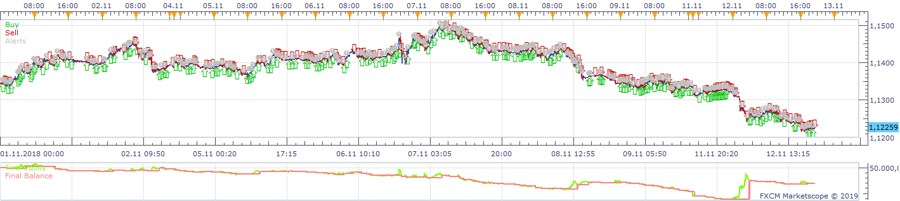
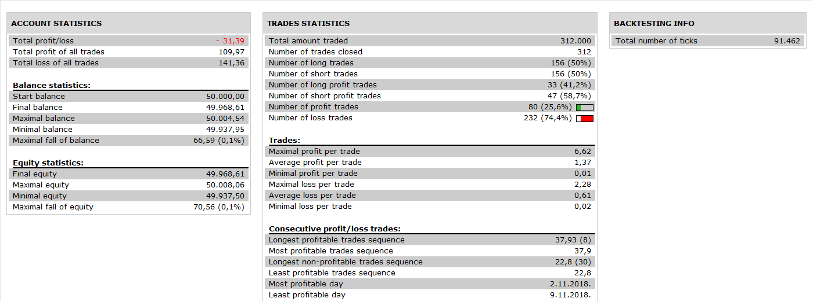

# WRB002 Strategy

> Source: https://fxcodebase.com/code/viewtopic.php?f=31&t=67345  
> Forum: 31 · Topic 67345 · 12 post(s)

---

## WRB002 Strategy

**Apprentice** · Wed Feb 13, 2019 5:18 am

 

Based on request.
[viewtopic.php?f=27&t=66479](https://fxcodebase.com/code/viewtopic.php?f=27&t=66479)

 [WRB002 Strategy.lua](files/123864/WRB002%20Strategy.lua)

---

## Re: WRB002 Strategy

**cfbaua** · Thu Feb 14, 2019 12:43 pm

I get the following message when I try back-testing on tick charts

Message	Time
C:/Program Files (x86)/Candleworks/FXTS2/Strategies/Custom/WRB002 Strategy.lua:75: Object is broken or '.' symbol is used instead of ':'.	02/14/2019 10:43:01

---

## Re: WRB002 Strategy

**Apprentice** · Mon Feb 18, 2019 5:48 am

Try it now.

---

## Re: WRB002 Strategy

**cfbaua** · Mon Feb 18, 2019 12:53 pm

The selector panel to choose a timeframe does not work when you load it in the strategy optimizer

---

## Re: WRB002 Strategy

**cfbaua** · Tue Feb 19, 2019 1:25 pm

HERE are two visual representations of the trading rules for WRB002
At present the rules have not been coded correctly. Please see attached pictures for the correct rules

---

## Re: WRB002 Strategy

**cfbaua** · Tue Feb 19, 2019 7:07 pm

Here is the second picture

---

## Re: WRB002 Strategy

**cfbaua** · Wed Feb 20, 2019 8:59 am

Short Entry and exit rules for WRB002 strategy

---

## Re: WRB002 Strategy

**cfbaua** · Sun Feb 24, 2019 11:53 am

I changed some of the code in the WRB0002 strategy and saved it with a new name WRB2. Entry points for long and shorts positions seem OK now, but the exit positions for long and short trades (at the bollinger middleband) do not work. Please see if you can correct this for me. I am not so good in lua programming (yet)

---

## Re: WRB002 Strategy

**cfbaua** · Sun Feb 24, 2019 11:53 am

I changed some of the code in the WRB0002 strategy and saved it with a new name WRB2. Entry points for long and shorts positions seem OK now, but the exit positions for long and short trades (at the bollinger middleband) do not work. Please see if you can correct this for me. I am not so good in lua programming (yet)

---

## Re: WRB002 Strategy

**Apprentice** · Thu Feb 28, 2019 5:47 am

Your request is added to the development list under Id Number 4504

---

## Re: WRB002 Strategy

**Apprentice** · Tue Mar 05, 2019 5:46 am

Can't repeat.

---

## Re: WRB002 Strategy

**cfbaua** · Wed Mar 06, 2019 10:08 am

The strategy still contains an error. It opens more than one trade at the time. Please correct this issue.
