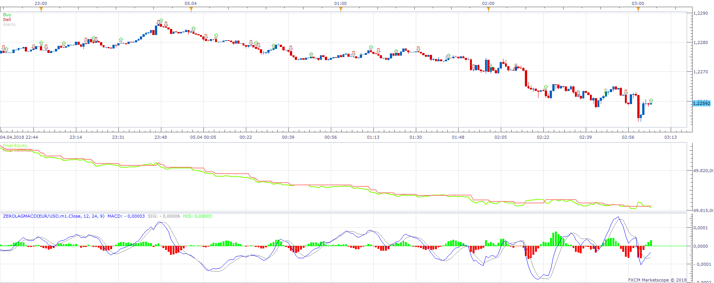
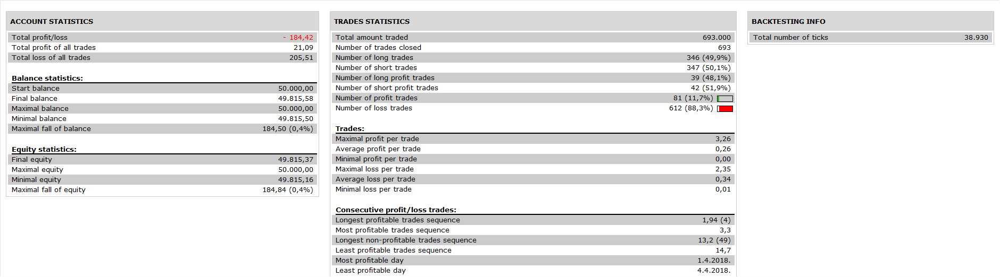

# ZeroLagMACD Strategy

> Source: https://fxcodebase.com/code/viewtopic.php?f=31&t=66908  
> Forum: 31 · Topic 66908 · 2 post(s)

---

## ZeroLagMACD Strategy

**Apprentice** · Sat Nov 10, 2018 7:06 am

 

Open Long
MACD/Signal Line CrossOver
Open Short
MACD/Signal Line CrossUnder

 [ZeroLagMACD Strategy.lua](files/122036/ZeroLagMACD%20Strategy.lua)

Based on indicator ZeroLagMACD.lua
[viewtopic.php?f=17&t=1623&hilit=ZeroLagMACD](https://fxcodebase.com/code/viewtopic.php?f=17&t=1623&hilit=ZeroLagMACD)

---

## Re: ZeroLagMACD Strategy

**ilnefopas** · Thu Nov 15, 2018 3:50 am

Thanks Apprentice, I should find my way with this.
I'll reach out if I need private sessions.
