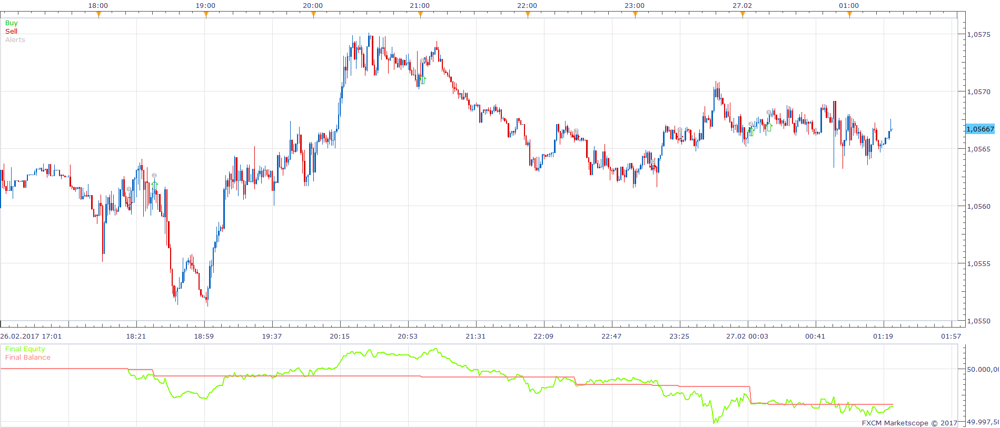
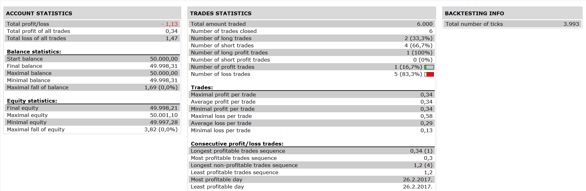

# Zig Zag DMI Strategy

> Source: https://fxcodebase.com/code/viewtopic.php?f=31&t=65337  
> Forum: 31 · Topic 65337 · 5 post(s)

---

## Zig Zag DMI Strategy

**Apprentice** · Mon Nov 06, 2017 5:17 am

 

Based on the request.
[viewtopic.php?f=27&t=65334](https://fxcodebase.com/code/viewtopic.php?f=27&t=65334)

Open Long:
1.ZIG ZAG1=DOWN
2.AND ZIG ZAG 2 =DOWN
3.AND DMI 2 POSITIVE > DMI 2 NEGATIVE
4.AND DMI 1 POSITIVE CROSS OVER DMI 1 NEGATIVE

Open Short:

1.ZIG ZAG 1= UP
2.AND ZIG ZAG 2=UP
3.AND DMI 2 NEGATIVE > DMI 2 POSITIVE
4.AND DMI 1 NEGATIVE CROSS OVER POSITIVE

 [Zig Zag DMI Strategy.lua](files/115879/Zig%20Zag%20DMI%20Strategy.lua)

The Strategy was revised and updated on January 21, 2019.

---

## Re: Zig Zag DMI Strategy

**rose123** · Wed Nov 08, 2017 12:33 pm

hi apprendice

can u add one more option to this strategy

zig zag 1 > zig zag 2----- for open long and
zig zag 1 < zig zag 2 ----for open short

then conditions will be as follows

Open Long:
1.ZIG ZAG1=DOWN
2.AND ZIG ZAG 2 =DOWN
3. AND ZIG ZAG 1 > ZIG ZAG 2
4.AND DMI 2 POSITIVE > DMI 2 NEGATIVE
5.AND DMI 1 POSITIVE CROSS OVER DMI 1 NEGATIVE

Open Short:

1.ZIG ZAG 1= UP
2.AND ZIG ZAG 2=UP
3.AND ZIG ZAG 1 <ZIG ZAG 2
4.AND DMI 2 NEGATIVE > DMI 2 POSITIVE
5.AND DMI 1 NEGATIVE CROSS OVER POSITIVE

---

## Re: Zig Zag DMI Strategy

**Apprentice** · Sun Nov 19, 2017 5:00 pm

Your request is added to the development list under Id Number 3953

---

## Re: Zig Zag DMI Strategy

**Apprentice** · Fri Nov 24, 2017 8:54 am

Try this version.

 [Zig Zag DMI Strategy.lua](files/116198/Zig%20Zag%20DMI%20Strategy.lua)

---

## Re: Zig Zag DMI Strategy

**rose123** · Fri Nov 24, 2017 12:03 pm

thanks apprendice
