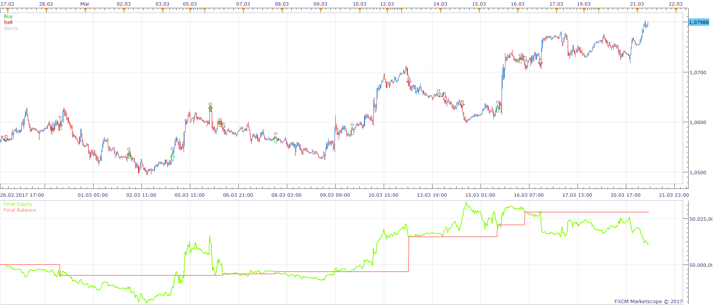
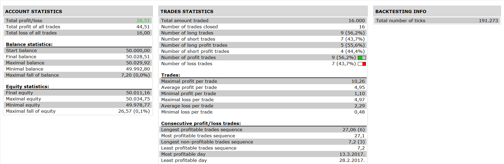

# ZIG ZAG MA STRATEGY

> Source: https://fxcodebase.com/code/viewtopic.php?f=31&t=65397  
> Forum: 31 · Topic 65397 · 1 post(s)

---

## ZIG ZAG MA STRATEGY

**Apprentice** · Sun Nov 26, 2017 6:55 am

 

Based on request.
[viewtopic.php?f=27&t=65395](https://fxcodebase.com/code/viewtopic.php?f=27&t=65395)

buy;
1.zig zag 1((current)= down and
2.zig zag 2(current)= down and
3.zig zag1(down)(current zig zag ) > zig zag2(down)(current zig zag) and
4.zig zag1 (up)(previous zig zag) < zig zag 2(up)((previous zig zag) and
5.ema 5 cross over ema 10

sell:
1.zig zag 1((current)= up and
2.zig zag 2(current)= up and
3.zig zag1(up)(current zig zag ) < zig zag2(up)(current zig zag) and
4.zig zag1 (down)(previous zig zag) > zig zag 2(down)((previous zig zag) and
5. ema 5 cross under ema 10

 [ZIG ZAG MA STRATEGY.lua](files/116217/ZIG%20ZAG%20MA%20STRATEGY.lua)

The Strategy was revised and updated on January 21, 2019.
