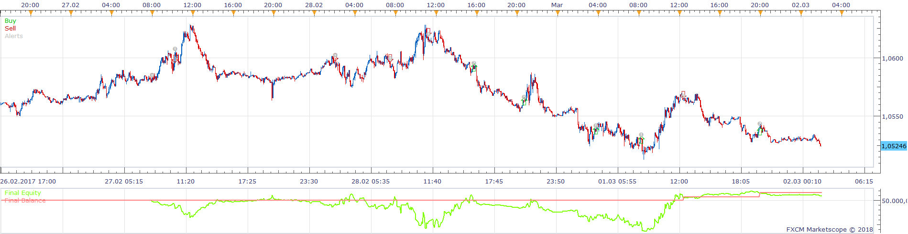
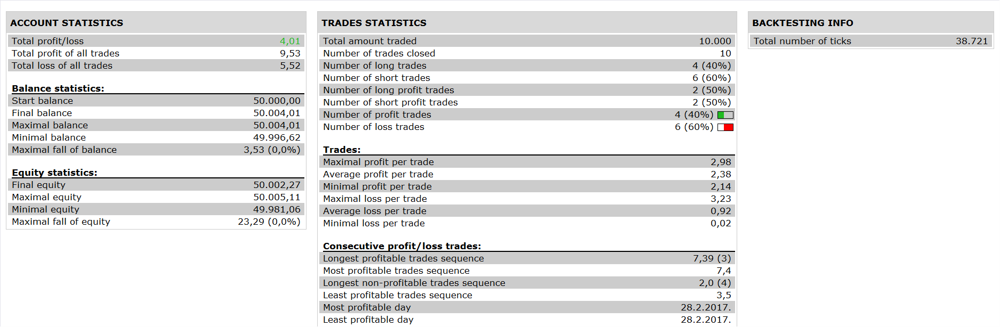

# ZIG ZAG TDI STOCHASTIC STRATEGY

> Source: https://fxcodebase.com/code/viewtopic.php?f=31&t=65504  
> Forum: 31 · Topic 65504 · 1 post(s)

---

## ZIG ZAG TDI STOCHASTIC STRATEGY

**Apprentice** · Wed Jan 03, 2018 7:47 am

 

Based on the request.
[viewtopic.php?f=27&t=65490](https://fxcodebase.com/code/viewtopic.php?f=27&t=65490)

Open Short
1.STOCH K >D AND K<OVERBOUGHT LEVEL AND K>OVERSOLD LEVEL
2.ZIG ZAG=DOWN
3.MKT BASE LINE < BUY LEVEL
4.TRD SIG LINE CROSS OVER MKT BASELINE

Vice versa for Short

The trader dynamic index can be found here.
[viewtopic.php?f=17&t=2069](https://fxcodebase.com/code/viewtopic.php?f=17&t=2069)

 [ZIG ZAG TDI STOCHASTIC STRATEGY.lua](files/116733/ZIG%20ZAG%20TDI%20STOCHASTIC%20STRATEGY.lua)

The Strategy was revised and updated on January 22, 2019.
