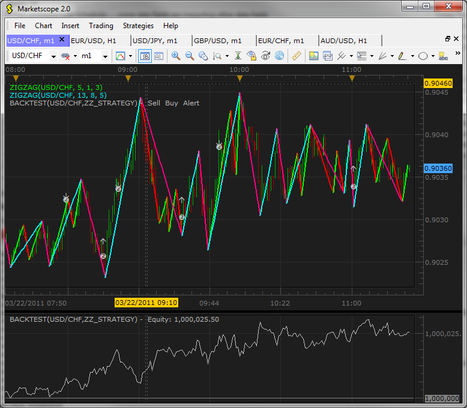
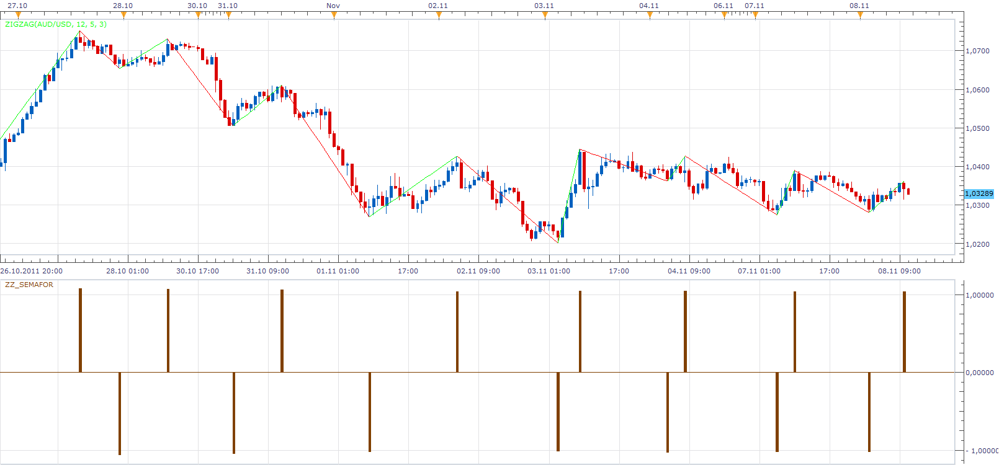
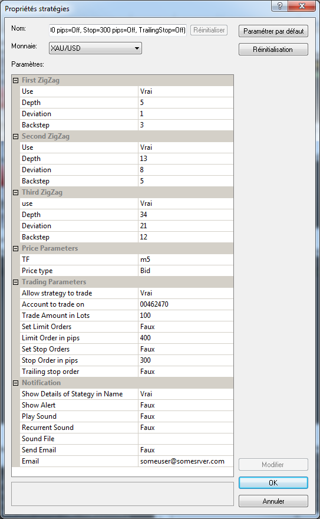
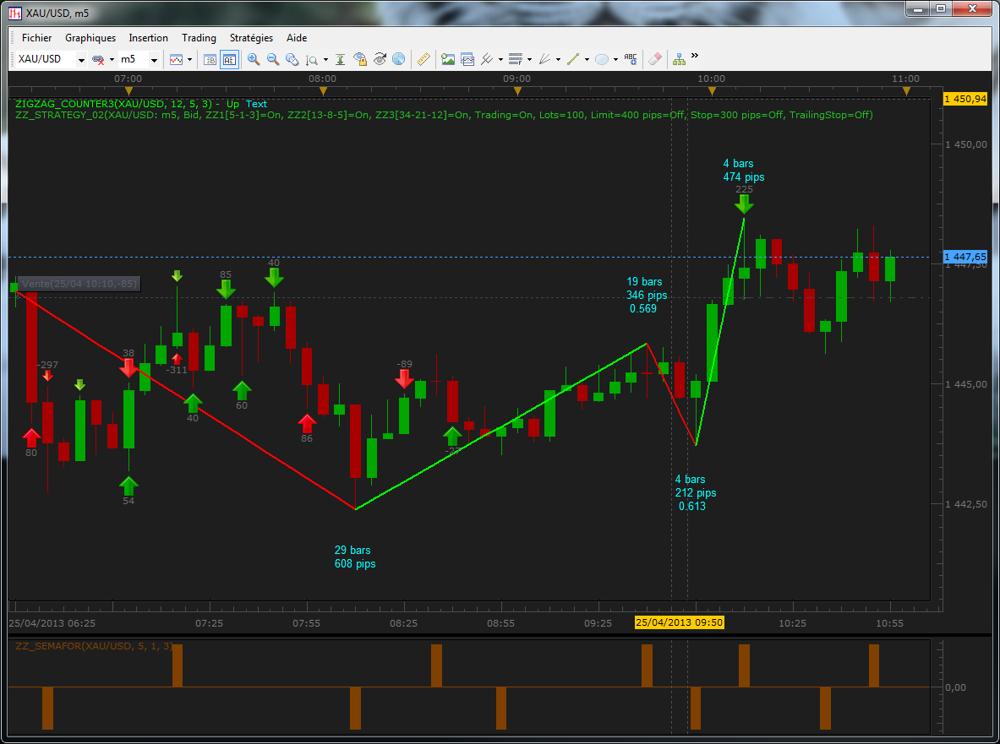
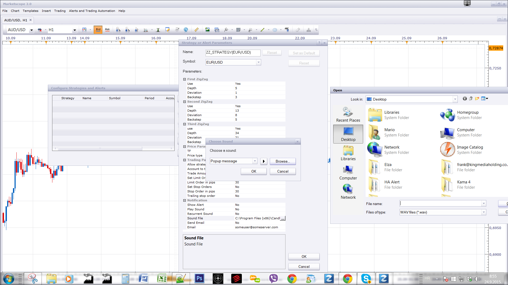

# ZigZag Strategy

> Source: https://fxcodebase.com/code/viewtopic.php?f=31&t=3703  
> Forum: 31 · Topic 3703 · 59 post(s)

---

## ZigZag Strategy

**vstrelnikov** · Tue Mar 22, 2011 10:55 am

Strategy based on ZigZag indicator. User can configure up to 3 indicators.

BUY conditions:
All selected indicator on the lower line

SELL conditions:
All selected indicator on the upper line

Note: You need to install ZZ_Semafor indicator for correct strategy work.

 

Indicator:

 [ZZ_Semafor.lua](files/8964/ZZ_Semafor.lua)

Strategy:

 [ZZ_Strategy.lua](files/8964/ZZ_Strategy.lua)

---

## Re: ZigZag Strategy

**R3boot** · Tue Mar 22, 2011 2:15 pm

Thanks,,

I tried to test it and i got an error [see attachment]

question: what is the ZZ semafor ? and what exactly do you use it for ? can it be add to the bottoms of the zigzag too ?

---

## Re: ZigZag Strategy

**Apprentice** · Tue Mar 22, 2011 2:58 pm

ZZ_Semafor is support indicator that is required for proper work of the strategy.

Regarding the reported errors.
I believe that it is the cause of the known bug.
Restart of the platform should fix things

---

## Re: ZigZag Strategy

**R3boot** · Tue Mar 22, 2011 7:01 pm

it worked,,, Thanks

---

## Re: ZigZag Strategy

**R3boot** · Wed Mar 23, 2011 7:33 pm

> **vstrelnikov wrote:**
> Strategy based on ZigZag indicator. User can configure up to 3 indicators.
>
> BUY conditions:
> All selected indicator on the lower line
>
> SELL conditions:
> All selected indicator on the upper line

I've been testing it, but I really didn't get the idea about going long or short. what do you mean by the upper line and the lower line?

---

## Re: ZigZag Strategy

**nicotrades** · Tue Nov 08, 2011 9:08 am

Dear Apprentice,

I dowload the ZZ-semaphor indicator and the result is as on the attached pic.

i guess, I'm getting only the indication when we reach the higher (brow part on the pics) but I don't get any indication when we get the lower.

Is it normal or could you modify it to get the both indication.

---

## Re: ZigZag Strategy

**Apprentice** · Tue Nov 08, 2011 11:17 am

This indicator is intended only to be a support for the strategy.
If you add it to chart as oscillator, you will see that it has both signals.
The signal for lows is in negative territory.

---

## Re: ZigZag Strategy

**nicotrades** · Tue Nov 08, 2011 7:52 pm

That you for your fast answer

Problem solve

best regards

Nico

---

## Re: ZigZag Strategy

**arindam89** · Wed Dec 21, 2011 9:19 am

> **Apprentice wrote:**
>
>
> zig.png
>
>
> This indicator is intended only to be a support for the strategy.
> If you add it to chart as oscillator, you will see that it has both signals.
> The signal for lows is in negative territory.

hi
good work aprentice
can you tell me how to add ZZ_SEMAFOR as an ossilator indicator in metascope
thanks
by
arindam

---

## Re: ZigZag Strategy

**arindam89** · Wed Dec 21, 2011 10:24 am

> **Apprentice wrote:**
>
>
> zig.png
>
>
> This indicator is intended only to be a support for the strategy.
> If you add it to chart as oscillator, you will see that it has both signals.
> The signal for lows is in negative territory.

hi
i have a question
does this strategy open a new position if any position is already open by the strategy itself
by

---

## Re: ZigZag Strategy

**arindam89** · Thu Dec 22, 2011 1:02 am

> **vstrelnikov wrote:**
> Strategy based on ZigZag indicator. User can configure up to 3 indicators.
>
> BUY conditions:
> All selected indicator on the lower line
>
> SELL conditions:
> All selected indicator on the upper line
>
> Note: You need to install ZZ_Semafor indicator for correct strategy work.
>
>
> ZZ_Strategy.png
>
>
>
> Indicator:
>
>
> ZZ_Semafor.lua
>
>
>
> Strategy:
>
>
> ZZ_Strategy.lua

hi
your strategy is great
but i have an issue
1.it only opens the 1st position it does not open a 2nd, 3rd, 4th .....corresponding positions
plesae look into the matter seriously
by

---

## Re: ZigZag Strategy

**superleo** · Thu Dec 22, 2011 8:57 am

sir,
can you create zigzag strategy in combination with ema 34.

buy: price above ema 34 and zz signal buy
sell: price below ema 34 and zz signal sell
exit buy : price cross under ema 34 or zz signal to sell
exit sell :price cross over ema 34 or zz signal to buy

thank you

---

## Re: ZigZag Strategy

**Apprentice** · Mon Dec 26, 2011 4:57 am

Your request is added to the developmental cue.

---

## Re: ZigZag Strategy

**briansummy** · Wed Feb 08, 2012 8:41 pm

This is a great strategy. Can you add a condition that the signals do not go against the traditional zig zag lines? This will help with false signals.

When Zig Zag line is Bearish then sell opens position from the Semafor signal and buy closes net positioning but does not go long. Wait for another sell signal agreement and then enter a new trade short which is again in agreement. Vice versa for Bullish. Thanks!!!

---

## Re: ZigZag Strategy

**Apprentice** · Thu Feb 09, 2012 6:20 am

Your request is added to the development list.

---

## Re: ZigZag Strategy

**briansummy** · Thu Feb 09, 2012 7:35 pm

I tried backtesting this on the GBPUSD Weekly Frequency. I added the ZZ_Semafor to the bottom as an oscillator. Visually it looks excellent for buys and sells but when I back test it the system does not execute accordingly. Where am I wrong here? Shouldn't it flip the position once new signal is set? Thanks! I am very glad to have found this website!

---

## Re: ZigZag Strategy

**briansummy** · Wed Mar 21, 2012 12:55 pm

Any luck with this coding? Thanks!!!

---

## Re: ZigZag Strategy

**Apprentice** · Thu Jun 07, 2012 2:59 am

Your request is added to the development list.

---

## Re: ZigZag Strategy

**Alexander.Gettinger** · Wed Jun 13, 2012 9:03 am

Zig&Zag indicator: [viewtopic.php?f=17&t=20167](https://fxcodebase.com/code/viewtopic.php?f=17&t=20167)

---

## Re: ZigZag Strategy

**don bergo** · Tue Jul 17, 2012 9:36 am

Hi, I'm Mikael and I'm new at this forum, thanx for having me! Lately I've been using the 123MW pattern indicator ([http://123mw.wordpress.com/2012/04/04/1 ... indicator/](http://123mw.wordpress.com/2012/04/04/123mw-pattern-indicator/)) which is a development of ZigZag. It signals buy and sell signals using arrows and points out where to begin and end a trade.

I wonder if it's possible two create an automated strategy based on this indicator for two time frames? Meaning that that that a trade will only be executed if the pattern has already appeared in the "bigger" TF?

Forgive me if my description is poor.

Thank you for a great site with invaluable resources!

Best regards
Mikael

---

## Re: ZigZag Strategy

**kankatrader** · Sat Oct 27, 2012 8:42 am

Hi,

is it possible, to add type of Signal: reversal for this Strategy?

Best Regards

Kankatrader

---

## Re: ZigZag Strategy

**Apprentice** · Sun Oct 28, 2012 4:23 am

Your request is added to the development list.

---

## Re: ZigZag Strategy

**LeTigre30** · Thu Apr 25, 2013 6:24 am

Hello to All,

For those traders who like (as me) see all details on charts, to avoid click and click to retrieve the setted parameters in an Indicator or Strategy, I've modified the showing way of the Name of this strategy. In the group "Notification", you can choose if you want see the details or not :

 

and the result if you have set "true" in the group Notification :

 

My next work will be to print in Red color in the name, if we have setted "true" for some printed details, as at this current time, I don't know how to do. If someone has an idea ...

Also, the next work will have an added .lua.rc file (if I have time).

 [ZZ_Strategy_02.lua](files/60006/ZZ_Strategy_02.lua)

---

## Re: ZigZag Strategy

**LeTigre30** · Sun May 05, 2013 6:07 pm

Hi to all who use this strategy,

I've observed a mismatch in the source code :
in the original source of ZZ_Strategy.lua, at line 171, the code is :

Code: [Select all](https://fxcodebase.com/code/)
`if up1 ~= nil and up2 ~= nil and u3 ~= nil then
            break;
        end`

as the variable u3 doesn't exist, I think that the command break is never executed, so the correction would be ?

Code: [Select all](https://fxcodebase.com/code/)
`if up1 ~= nil and up2 ~= nil and up3 ~= nil then
            break;
        end`
oddly, when the strategy is loaded in TS2, we receive no errors, same with the Indicore SDK in the strategy debugger.

Moreover, is someone can explain why Buy or Sell orders do not follow the displaying of the signals given by the indicator ZZ_Semafor (even with the same parameters)?

Thanks for replying,

Regards.

---

## Re: ZigZag Strategy

**easytrading** · Wed Jun 03, 2015 2:55 am

> **Alexander.Gettinger wrote:**
> Zig&Zag indicator: [viewtopic.php?f=17&t=20167](https://fxcodebase.com/code/viewtopic.php?f=17&t=20167)

Apprentice , why i cannot access the above Zig&Zag indicator link provided by Alexander? could u fix it or provide another link ,please?
with many thanks.

---

## Re: ZigZag Strategy

**Apprentice** · Fri Jun 05, 2015 6:56 am

Try this one.
[viewtopic.php?f=17&t=20167](https://fxcodebase.com/code/viewtopic.php?f=17&t=20167)

---

## Re: ZigZag Strategy

**easytrading** · Fri Jun 05, 2015 2:15 pm

still the same problem.first the link requirs me to log in to my forum account and then this message appears to me after log in ,"You are not authorised to read this forum".for that link ???

---

## Re: ZigZag Strategy

**Apprentice** · Sun Jun 07, 2015 3:19 am

Oh now I see.
This one is on private section of the forum.
For now will not be available to the public.

---

## Re: ZigZag Strategy

**jenniferFX888** · Wed Sep 23, 2015 8:23 pm

Hi LeTigre30,

At the Sound file can you give us an option to choose sound and browser the sound file.
[http://screencast.com/t/YNzqKe2lR](http://screencast.com/t/YNzqKe2lR)

Thank you,

jenni

---

## Re: ZigZag Strategy

**Apprentice** · Thu Sep 24, 2015 2:31 am

You can do it already.

---

## Re: ZigZag Strategy

**jenniferFX888** · Thu Sep 24, 2015 3:11 pm

Hi Apprentice,

Either i dont have the same version as you have but the one i m using is look exactly like the one LeTigre posted here. Pls see the link screenshot i attached. There is no option to choose the sound file folder. [http://screencast.com/t/YNzqKe2lR](http://screencast.com/t/YNzqKe2lR)

Thank you,

jenni

---

## Re: ZigZag Strategy

**dandee** · Sat Dec 26, 2015 6:58 am

Can this strategy be modified so the user can select whether to buy or sell instead of the strategy doing that and the user having the choice of selecting close on reverse and also user determine how many open position in each direction instead of the strategy closing out the position on reversing.Also I think there is a bug where if you run this on 2 different timeframes or 2 different instruments when the canclose() function is called it close all positions in both instuments

---

## Re: ZigZag Strategy

**Apprentice** · Mon Dec 28, 2015 5:57 am

Your request is added to the development list.

---

## Re: ZigZag Strategy

**LeTigre30** · Fri Mar 11, 2016 12:54 pm

Hello Apprentice,

I observed today a problem with this strategy. it enters only Sell Orders, never Buy orders.

Could you send me your feedback about this.
NB : I modified the name of the exit function by 'exitspecific' and enter by 'enterspecific'
due to Lua order 'exit'.

When the Sell orders are closed, it never open Buy orders ...

Does this strategy is compatible with indicore3 SDK ?

Bst Rgds

The code seems correct :

 local signal = ''
 if Use1 then signal = signal .. tostring(up1) end
 if Use2 then signal = signal .. tostring(up2) end
 if Use3 then signal = signal .. tostring(up3) end

 if signal ~= prevSignal then
 if (not Use1 or (Use1 and up1)) and
 (not Use2 or (Use2 and up2)) and
 (not Use3 or (Use3 and up3)) then
 exitspecific('B')
 enterspecific('S');

 if ShowAlert then
 ExtSignal(source, period, "SELL", SoundFile, Email, RecurrentSound);
 end

 elseif (not Use1 or (Use1 and not up1)) and
 (not Use2 or (Use2 and not up2)) and
 (not Use3 or (Use3 and not up3)) then
 exitspecific('S')
 enterspecific('B');

 if ShowAlert then
 ExtSignal(source, period, "BUY", SoundFile, Email, RecurrentSound);
 end
 end

---

## Re: ZigZag Strategy

**LeTigre30** · Sun Apr 10, 2016 12:53 am

Hello Apprentice,

A member requests some monthes ago, if this ZZ strategy could be mixed with ema 34, does this strategy is done ?

BST Rgds

---

## Re: ZigZag Strategy

**JOKER83** · Thu Aug 11, 2016 5:53 pm

NICE STRATEGY

CAN YOU MAKE A EXIT OPTION
FOR ALL INDICATORS

AND OPTION
BUY
SELL
BOTH

---

## Re: ZigZag Strategy

**Apprentice** · Mon Aug 15, 2016 2:18 am

Can you define EXIT OPTION?

---

## Re: ZigZag Strategy

**JOKER83** · Mon Aug 15, 2016 5:54 am

> **Apprentice wrote:**
> Can you define EXIT OPTION?

 1 Indicator Close trades yes/No

 2 Indicator Close trades yes/No

 3 Indicator Close trades yes/No

Other version

Highly adaptable zig zag strategy

1 Indicator buy , Sell , close , Alert

 2 Indicator buy , Sell , close , Alert

 3 Indicator buy , Sell , close , Alert

---

## Re: ZigZag Strategy

**Apprentice** · Thu Aug 25, 2016 5:26 am

Your request is added to the development list, Under Id Number 3609
 If someone is interested to do this task, please contact me.

---

## Re: ZigZag Strategy

**JOKER83** · Wed Oct 05, 2016 6:38 pm

can you make Highly adaptable zig zag strategy

 PLEASE

---

## Re: ZigZag Strategy

**dogxyz** · Sun Oct 16, 2016 11:39 am

Hi, as I know the original ZigZag indicator is repainted. Whether is this ZZ_semaFor is no repaint?

---

## Re: ZigZag Strategy

**papynou34** · Mon Nov 14, 2016 4:56 am

Hello All,
I tested the strategy, and it seems to me that only Sell orders are passed?
Am i right?

Thanks a lot for your great job.

---

## Re: ZigZag Strategy

**Apprentice** · Sun Dec 18, 2016 8:18 am

Strategy was revised and updated.

---

## Re: ZigZag Strategy

**LeTigre30** · Sun Dec 18, 2016 1:15 pm

hi Apprentice,
I would like to download the new version of this strategy, but no link is shown to download it. I found a link like viewtopice ....php, but i receive a message indicating i'm not authorized to see the contents.
do I make a mistake ?

bst rgds

---

## Re: ZigZag Strategy

**LeTigre30** · Sun Dec 18, 2016 1:28 pm

following my previous post : the unaccessed topic is viewtopic.php?f=17&t=20167

---

## Re: ZigZag Strategy

**Apprentice** · Mon Dec 19, 2016 4:27 pm

Topic has been moved to the private section.

---

## Re: ZigZag Strategy

**LeTigre30** · Mon Dec 19, 2016 5:42 pm

hi mario,

How I can see the new code of this strategy ?
LeTigre30

---

## Re: ZigZag Strategy

**Apprentice** · Thu Dec 22, 2016 1:36 pm

Unfortunately will be inaccessible until further notice.

---

## Re: ZigZag Strategy

**LeTigre30** · Thu Dec 22, 2016 1:43 pm

hi Mario,

This is due to what?

I have noted some inconsistencies in the code and have therefore participated in its evolution, see my previous posts.

bst rgds

---

## Re: ZigZag Strategy

**Apprentice** · Sat Dec 24, 2016 5:56 am

I believe we received copyright violation complaint.

---

## Re: ZigZag Strategy

**AEKARAOLE** · Thu Nov 22, 2018 4:44 am

Hi apprentice,
There is a problem with strategy alerts, it open trades and does not send emails (all my settings are correct and I get regular emails from all the others strategies).

Thank you

---

## Re: ZigZag Strategy

**Apprentice** · Thu Nov 22, 2018 6:15 am

Can you please send version used to my email.
mario(.)jemic(@)gmail(.)com
With reference/link to this post.

---

## Re: ZigZag Strategy

**Apprentice** · Thu Nov 22, 2018 6:42 am

Show Alert and SendEmail are set to yes?

---

## Re: ZigZag Strategy

**AEKARAOLE** · Thu Nov 22, 2018 7:40 am

Hi apprentice,
I registered again the strategy and now I receive notifications normally.
Thank you

---

## Re: ZigZag Strategy

**AEKARAOLE** · Fri Nov 23, 2018 6:15 am

Hi apprentice,

Can you add to the strategy the parameters: 1) breakeven and 2) trailing stop per 10 or 20 or 30 pips

Strategy:

 ZZ_Strategy.lua
(14.12 KiB) Downloaded 2732 times

Posts: 59
Joined: Tue Jul 06, 2010 8:31 pm
Private messageE-mail

---

## Re: ZigZag Strategy

**Apprentice** · Sun Nov 25, 2018 5:35 am

Your request is added to the development list under Id Number 4328

---

## Re: ZigZag Strategy

**Apprentice** · Mon Nov 26, 2018 5:52 am

Try this version.

 [ZZ_Strategy.lua](files/122355/ZZ_Strategy.lua)

---

## Re: ZigZag Strategy

**AEKARAOLE** · Tue Nov 27, 2018 7:30 am

Thank you apprentice

---

## Re: ZigZag Strategy

**Alexander.Gettinger** · Tue Mar 19, 2019 9:57 pm

> **dandee wrote:**
> Can this strategy be modified so the user can select whether to buy or sell instead of the strategy doing that and the user having the choice of selecting close on reverse and also user determine how many open position in each direction instead of the strategy closing out the position on reversing.Also I think there is a bug where if you run this on 2 different timeframes or 2 different instruments when the canclose() function is called it close all positions in both instuments

Please try this strategy:

 [ZZ_Strategy2.lua](files/124800/ZZ_Strategy2.lua)
