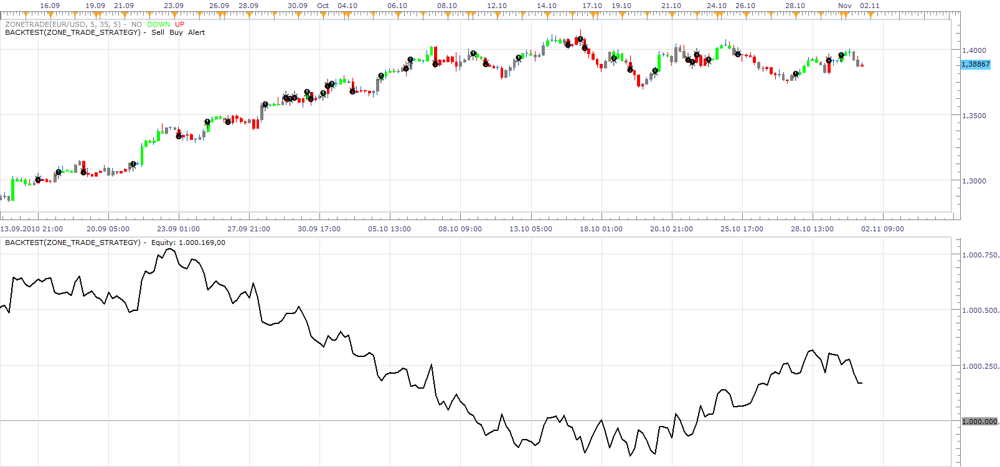

# Zone Trade Strategy

> Source: https://fxcodebase.com/code/viewtopic.php?f=31&t=2567  
> Forum: 31 · Topic 2567 · 13 post(s)

---

## Zone Trade Strategy

**Apprentice** · Mon Nov 01, 2010 2:36 pm

This is a 3 in 1 strategy, It provide possibility for trading with the Awesome, Acceleration / Deceleration (AC) oscillators and Bill Williams Zone Trading.

Helper indicator can be found here.
[viewtopic.php?f=17&t=638&p=97194&hilit=zone+trade#p97194](https://fxcodebase.com/code/viewtopic.php?f=17&t=638&p=97194&hilit=zone+trade#p97194)

 [ZONE_TRADE_STRATEGY.lua](files/5729/ZONE_TRADE_STRATEGY.lua)

---

## Re: Zone Trade Strategy

**Apprentice** · Thu Apr 14, 2011 5:07 am

Compatibility issues resolved.

---

## Re: Zone Trade Strategy

**Segwin** · Mon Aug 24, 2015 6:56 pm

Hello Apprentice:

At looking at the attached picture am I reading it correctly that the strategy seems to be losing money for most of the way and only starting to make money towards the end?

TIA,

Terry

---

## Re: Zone Trade Strategy

**Apprentice** · Tue Dec 19, 2017 9:05 am

The strategy was revised and updated.

---

## Re: Zone Trade Strategy

**kankatrader** · Wed Nov 14, 2018 8:37 am

Hi,

I would like to have the following additions for this Zone Trade Strategy

CCI and Stochastic RSI indicators.

Buy:
Heiken Ashi candle is green
CCI Color is green
Stochastic RSI: If Price Line K and D cross over the OverSold line Level 20 from the bottom to the top

Sell:
Heiken Ashi candle is red
CCI Color is green
Stochastic RSI: If Price Line K and D cross under the OverBought line Level 80 from top to bottom

Thanks in advance

---

## Re: Zone Trade Strategy

**kankatrader** · Wed Nov 14, 2018 4:39 pm

I have made a mistake in the description. following description is correct for Sell

Sell:
Heiken Ashi candle is red
CCI Color is red
Stochastic RSI: If Price Line K and D cross under the OverBought line Level 80 from top to bottom

---

## Re: Zone Trade Strategy

**kankatrader** · Thu Nov 15, 2018 5:53 am

Hi
if neutral close position is set to false then the position will be closed anyway

---

## Re: Zone Trade Strategy

**Apprentice** · Thu Nov 15, 2018 4:13 pm

Can you define CCI Color (Green/ Red)

---

## Re: Zone Trade Strategy

**kankatrader** · Thu Nov 15, 2018 4:27 pm

for buy cci indicator bar green must coincide with heiken ashi green at the same time.
 for Sell cci indicator bar red must coincide with Heiken ashi red at the same time,
and stochastic as described above

---

## Re: Zone Trade Strategy

**Apprentice** · Thu Nov 15, 2018 4:30 pm

> for buy cci indicator bar green must coincide

Can you define rules for CCI long trade

---

## Re: Zone Trade Strategy

**kankatrader** · Thu Nov 15, 2018 4:39 pm

If iWhen I arrive home I will send a chart picture so I can explain it better

---

## Re: Zone Trade Strategy

**kankatrader** · Thu Nov 15, 2018 4:47 pm

Here is a description I found on YouTube so the strategy should work [https://youtu.be/WZ2eCHvS6Jk](https://youtu.be/WZ2eCHvS6Jk)

---

## Re: Zone Trade Strategy

**Apprentice** · Thu Nov 15, 2018 5:29 pm

Try this version.
[viewtopic.php?f=31&t=66931&p=122132#p122132](https://fxcodebase.com/code/viewtopic.php?f=31&t=66931&p=122132#p122132)
