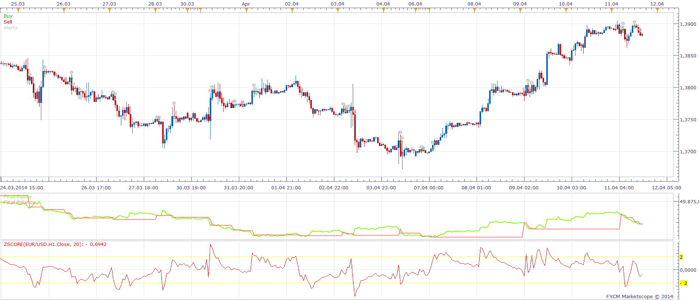

# ZScore Strategy

> Source: https://fxcodebase.com/code/viewtopic.php?f=31&t=60628  
> Forum: 31 · Topic 60628 · 18 post(s)

---

## ZScore Strategy

**Apprentice** · Fri May 02, 2014 6:42 am

Posted by request.
[viewtopic.php?f=27&t=60614](https://fxcodebase.com/code/viewtopic.php?f=27&t=60614)

Will execute selected trade upon Zscore cross a line of interest.
Lines of interest to us are OB / OS and Central ZScore Line

Please install Z Score Indicator.
[viewtopic.php?f=17&t=8619&hilit=zscore](https://fxcodebase.com/code/viewtopic.php?f=17&t=8619&hilit=zscore)

 [Zscore Strategy.lua](files/93786/Zscore%20Strategy.lua)

 [Zscore Strategy with selectable Time Frame.lua](files/93786/Zscore%20Strategy%20with%20selectable%20Time%20Frame.lua)

Zscore Strategy with selectable Time Frame will allow you selection of Zscore Time frame.

The Strategy was revised and updated on December 11, 2018.

---

## Re: ZScore Strategy

**davidnwatson** · Fri May 02, 2014 8:37 am

Got the file, I installed the strategy and up installs, but does not show up in list. It is in the custom strategy in Marketscope.. rebooted computer to make sure I was not crazy..

Thanks for any help and excited to get a Strategy for Zscore..

David

---

## Re: ZScore Strategy

**davidnwatson** · Fri May 02, 2014 8:43 am

It installed up under the indicator list and looks like the indicator not the strategy.. Even thought it is in the custom strategy folder..

---

## Re: ZScore Strategy

**Apprentice** · Fri May 02, 2014 8:48 am

Try to re-dowload it again.
It should work now.
I have tested it, everything is ok now.

---

## Re: ZScore Strategy

**davidnwatson** · Fri May 02, 2014 8:55 am

It's working now.. Thank you so much..

---

## Re: ZScore Strategy

**davidnwatson** · Fri May 02, 2014 9:05 am

Not something you have to do today, but a nice feature would be to allow "End of Turn" or "Live" mode..

Other than the above I am one happy person today..

Thanks again for taking the time to do this for me..

---

## Re: ZScore Strategy

**joxemi** · Thu May 29, 2014 11:56 am

Hello all:

I am using this strategy mostly trying with optimized pairs. I would understand exactly the meaning of cross over and cross under line. For example:

With OB line. When the strategy says cross over means that the signal line cross OB line from the under going up, or from the over to down.

With OS line. When the strategy says cross over means that the signal cross OS line from the under going up, or the oppiste.

Probably this question is very easy for native English speakers, but not for me

Thanks in advance,

Joxemi

---

## Re: ZScore Strategy

**Apprentice** · Fri May 30, 2014 4:15 am

Cross Over will be
Previous Period ZScore is below the Lines
Current Period ZScore is above the Lines

Cross Under will be
Previous Period ZScore is above the Lines
Current Period ZScore is below the Lines

---

## Re: ZScore Strategy

**joxemi** · Fri May 30, 2014 4:23 am

Thank you Apprentice! It is very Simple and good explanation.

---

## Re: ZScore Strategy

**davidnwatson** · Thu Jul 31, 2014 10:06 pm

> but a nice feature would be to allow "End of Turn" or "Live" mode..

Was this added to the developer list?

---

## Re: ZScore Strategy

**davidnwatson** · Wed Aug 06, 2014 7:21 am

Could you please add the choice of time frame for the indicator within the strategy?

Example:
Strategy Parameters
 Period: (changeable)
 OB Level: (changeable)
 OS Level: (changeable)
 Timeframe: 1 min to 1 month (changeable)

So if I want to have the indicator work on the 5 minute chart, with each new bar check the indicator and trade accordingly ..

So if on the 5 min chart the 4 hour Zscore drops below the 0 line I want it to open a sell trade. This need to happen on the next 5 min bar, not 4 hours later..

David

---

## Re: ZScore Strategy

**Apprentice** · Sat Aug 09, 2014 5:21 am

Zscore Strategy with selectable Time Frame added.

---

## Re: ZScore Strategy

**Apprentice** · Wed Sep 10, 2014 4:47 am

From: joxemi
To: Apprentice

Thanks for your good work. The strategy works fine, except the parameter "(One side) Position Number Limit)" Mostly, if you have i.e. 2 in this parameter, the strategy opens 3 or 4 times.

I am not sure the reason of this behaviour. Perhaps is in relation with the var doesn't work well.

The other reason perhaps is: I saw sometimes when the system launch an operation, the strategy doesn't identify the name of the strategy (specify in parámeter "Custom Identifier"). So is possible strategy launch more operations because "thinks" it can launch more.

For me is very important this parámeter. Normally is better specify 2 or 3 times, but no more.

Thank you very much for your work and for your collaboration

Joxemi

---

## Re: ZScore Strategy

**Apprentice** · Wed Sep 10, 2014 5:14 am

For Both issues.
Is it tested on live / demo account or within Backtester.

About "Custom Identifier".
If I understand what you're saying, strategy will interact with other instances positions.

---

## Re: ZScore Strategy

**joxemi** · Wed Sep 10, 2014 7:31 am

After your answer, I have made other tests, and I explain the results:

1. Backtesting
In backtesting, allways the strategy opens the parameter "(one side)...." +1. i.e. If you specific 1, opens 2, if 2, opens 3.
(I always tested in live. In backtesting is necessary zoom a lot to see that)

2. Custom identifier.
I analyzed better the graphics. Apparently, when the operations are lauched very clossed, you can see one of them the name, strategy, but no the other. So it is necessary reduce the time frame graphic to 1 minute or so, for see the exactly name of each operation.
So it seems that this parameter works fine.

Thank you very much,

Joxemi

---

## Re: ZScore Strategy

**davidnwatson** · Thu Oct 02, 2014 10:22 am

I like the zscore stragety. would be it possible to have a indicator filter confirmation zscore strategy?

Example

Normal zscore strategy

Indicator Confirmation
Use Filter: Yes/No
Time frame:(Any time frame m1 to 1month)
Period:(user select)
Validation Zone width in pips
Method: (Moving averages, RSI, MACD and EWO)

---

## Re: ZScore Strategy

**Apprentice** · Sat Oct 04, 2014 2:19 am

Now it is.

---

## Re: ZScore Strategy

**Apprentice** · Sun Dec 11, 2016 9:49 am

Strategy was revised and updated.
