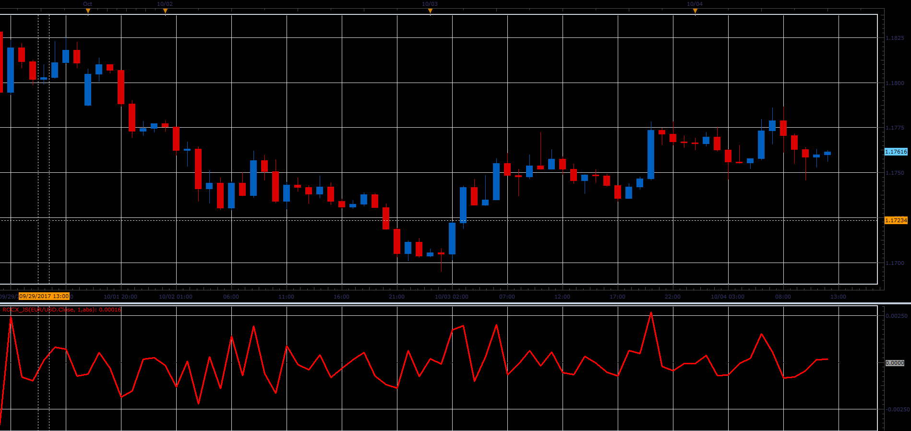

# Absolute Rate Of Change Value

> Source: https://fxcodebase.com/code/viewtopic.php?f=48&t=65258  
> Forum: 48 · Topic 65258 · 1 post(s)

---

## Absolute Rate Of Change Value

**Alexander.Gettinger** · Sat Oct 28, 2017 11:35 am

Formulas:
ROCX = diff for Mode = Absolute value,
ROCX = 100*diff/PrN for Mode = % value,
ROCX = 1000*diff/PrN for Mode = %% value, where
diff[i] = Price[i]-Price[i-Length],
PrN = Price[i-Length].

 

Download:

 [ROCX_JS.jsl](files/115682/ROCX_JS.jsl)
