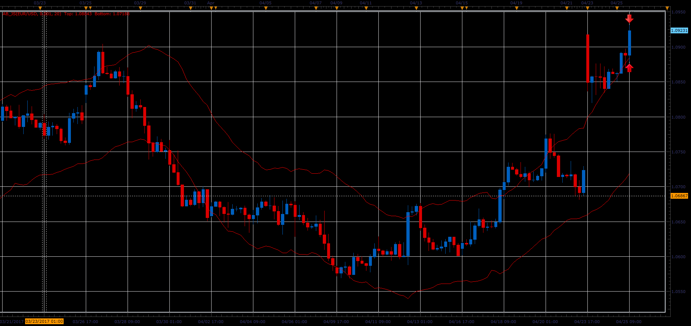

# Acceleration Bands

> Source: https://fxcodebase.com/code/viewtopic.php?f=48&t=64753  
> Forum: 48 · Topic 64753 · 1 post(s)

---

## Acceleration Bands

**Alexander.Gettinger** · Mon Jun 05, 2017 11:56 am

Formula:
Upperband = ( High * ( 1 + 2 * (((( High - Low )/(( High + Low ) / 2 )) * 1000 ) * Factor )));
Lowerband = ( Low * ( 1 - 2 * (((( High - Low )/(( High + Low ) / 2 )) * 1000 ) * Factor )));

 

Download:

 [AB_JS.jsl](files/112764/AB_JS.jsl)
