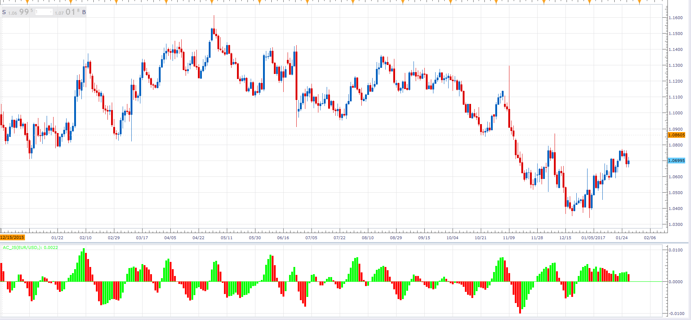

# Acceleration/Deceleration

> Source: https://fxcodebase.com/code/viewtopic.php?f=48&t=64351  
> Forum: 48 · Topic 64351 · 1 post(s)

---

## Acceleration/Deceleration

**Alexander.Gettinger** · Fri Jan 27, 2017 11:41 am

Acceleration/Deceleration Indicator (AC) measures acceleration and deceleration of the current driving force.

 

Download:

 [AC_JS.jsl](files/110743/AC_JS.jsl)
