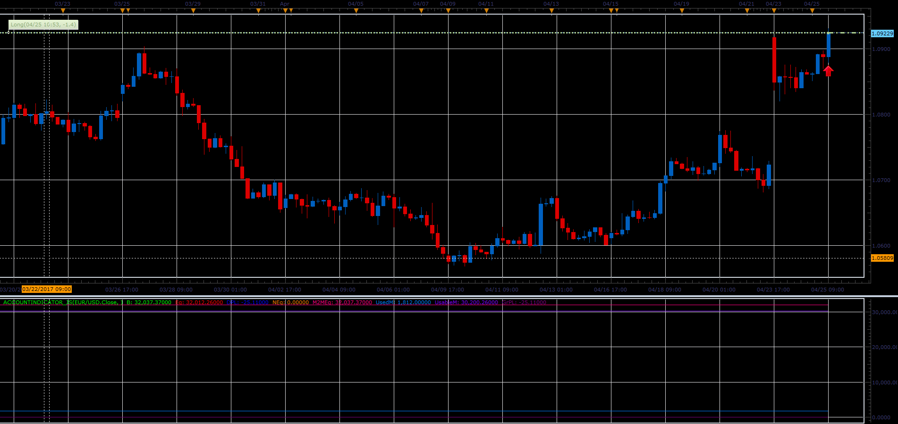

# Account indicator

> Source: https://fxcodebase.com/code/viewtopic.php?f=48&t=64756  
> Forum: 48 · Topic 64756 · 1 post(s)

---

## Account indicator

**Alexander.Gettinger** · Mon Jun 05, 2017 12:01 pm

The indicator show follow accounts characteristics as lines:
Balance - The amount of funds in the account without taking into consideration profits and losses on all open positions,
Equity - The amount of funds in the account, including profits and losses on all open positions,
DayPL - The profit and loss during the current trading day,
NontrdEqty - The amount of funds that is deposited, transferred to, and/or withdrawn from the account during the current trading day,
M2MEquity - The "floating" balance of the account at the beginning of the trading day,
UsedMargin - The amount of funds currently committed to maintain all open positions in the account,
UsableMargin - The amount of funds available to open new positions or to absorb any losses on the existing positions,
GrossPL - The profit and loss on all open positions in the account.

 

Download:

 [AccountIndicator_JS.jsl](files/112767/AccountIndicator_JS.jsl)
