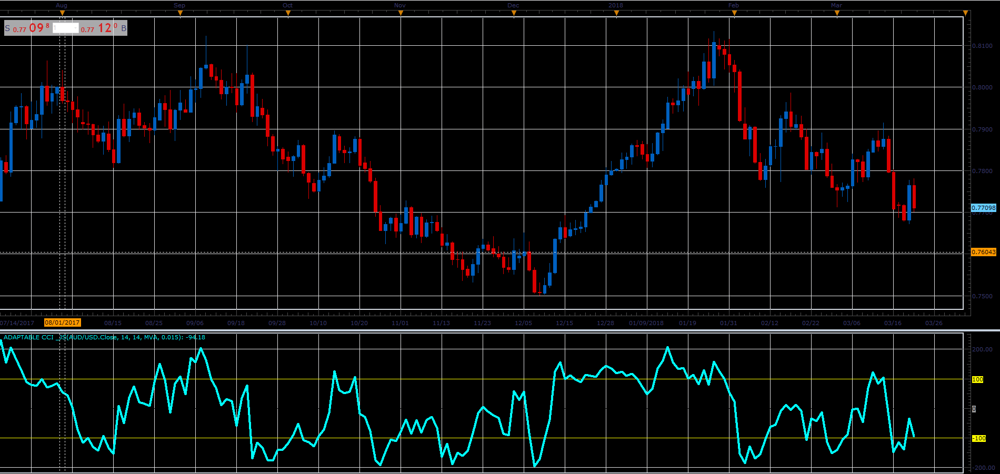

# Adaptable CCI

> Source: https://fxcodebase.com/code/viewtopic.php?f=48&t=65896  
> Forum: 48 · Topic 65896 · 1 post(s)

---

## Adaptable CCI

**Alexander.Gettinger** · Wed Apr 11, 2018 1:45 pm

Formulas:
ACCI[i] = (Price[i]-mean)/(meandev*Correction_Factor), where
mean = MA(Price) with [Average_Length] number of periods and [Method] type,
meandev = SumD/Deviation_Length,
SumD - sum of Abs(Price-Avg) at range from (i-Deviation_Length+1) to (i),
Avg = MVA(Price) with [Deviation_Length] numner of periods,
Abs - absolute value.

 

Download:

 [Adaptable CCI _JS.jsl](files/118559/Adaptable%20CCI%20_JS.jsl)
