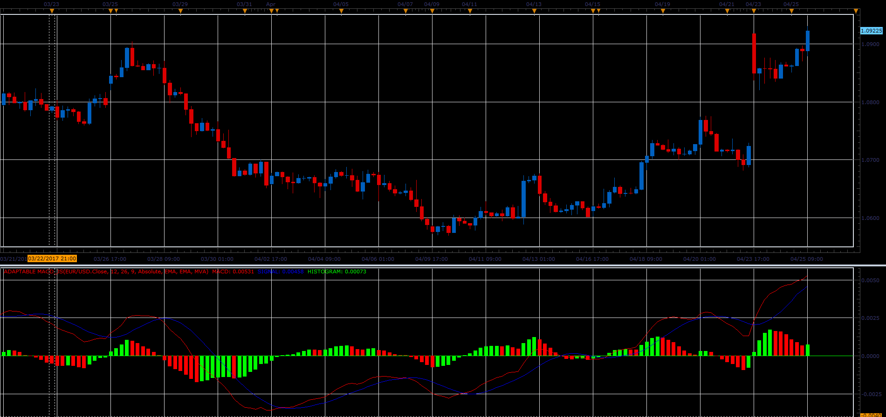

# Adaptable MACD

> Source: https://fxcodebase.com/code/viewtopic.php?f=48&t=64758  
> Forum: 48 · Topic 64758 · 1 post(s)

---

## Adaptable MACD

**Alexander.Gettinger** · Mon Jun 05, 2017 12:04 pm

The indicator allows you to change type of moving averages used to calculate the MACD indicator.

 

Download:

 [Adaptable MACD_JS.jsl](files/112769/Adaptable%20MACD_JS.jsl)
