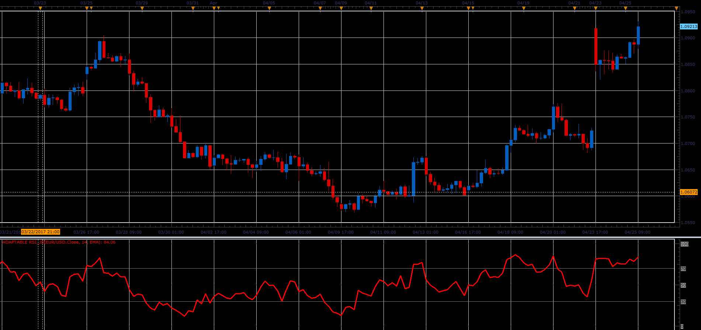

# Adaptable RSI

> Source: https://fxcodebase.com/code/viewtopic.php?f=48&t=64759  
> Forum: 48 · Topic 64759 · 1 post(s)

---

## Adaptable RSI

**Alexander.Gettinger** · Mon Jun 05, 2017 12:07 pm

The indicator allows you to change type of moving average used to calculate the RSI indicator.

 

Download:

 [Adaptable RSI_JS.jsl](files/112770/Adaptable%20RSI_JS.jsl)
