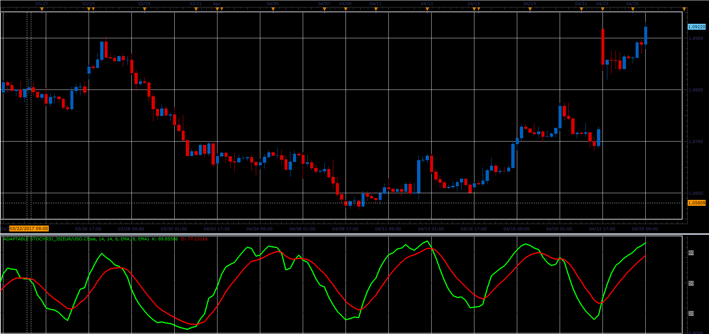

# Adaptable Stochastic RSI

> Source: https://fxcodebase.com/code/viewtopic.php?f=48&t=64760  
> Forum: 48 · Topic 64760 · 1 post(s)

---

## Adaptable Stochastic RSI

**Alexander.Gettinger** · Mon Jun 05, 2017 12:09 pm

This version of Stochastic RSI allows the user to choose the method of smoothing for K and D lines.

 

Download:

 [Adaptable StochRSI_JS.jsl](files/112771/Adaptable%20StochRSI_JS.jsl)
