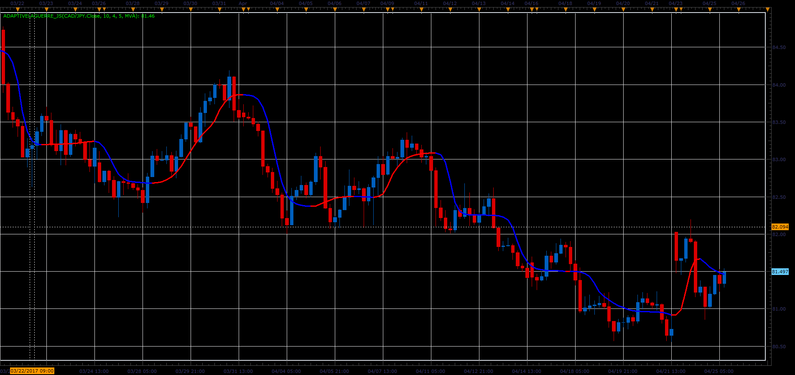

# Adaptive Laguerre indicator

> Source: https://fxcodebase.com/code/viewtopic.php?f=48&t=64761  
> Forum: 48 · Topic 64761 · 1 post(s)

---

## Adaptive Laguerre indicator

**Alexander.Gettinger** · Mon Jun 05, 2017 12:10 pm

Download:

 [AdaptiveLaguerre_JS.jsl](files/112772/AdaptiveLaguerre_JS.jsl)

For this indicator must be installed Averages indicator ([viewtopic.php?f=17&t=2430](https://fxcodebase.com/code/viewtopic.php?f=17&t=2430)).
