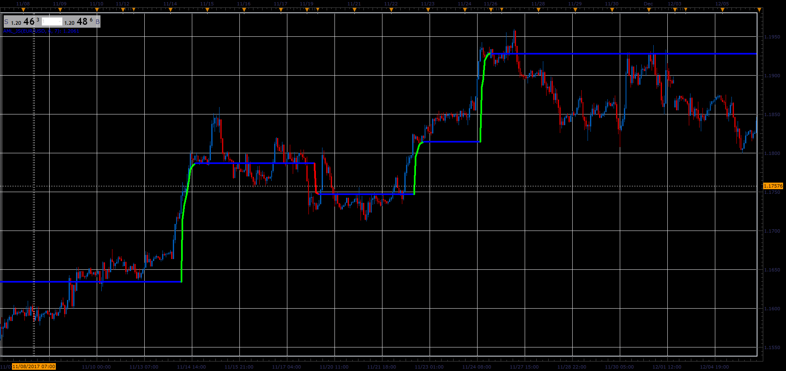

# Adaptive Market Level

> Source: https://fxcodebase.com/code/viewtopic.php?f=48&t=65557  
> Forum: 48 · Topic 65557 · 1 post(s)

---

## Adaptive Market Level

**Alexander.Gettinger** · Sat Jan 06, 2018 3:09 pm

The indicator is based on fractal smoothing (known as FRAMA ).
It have a discrete filter that removes minor price movements,
if relative flat movement does not exceed the square of the interval dimension in the specified interval it is ignored.

 

Download:

 [AML_JS.jsl](files/116836/AML_JS.jsl)
