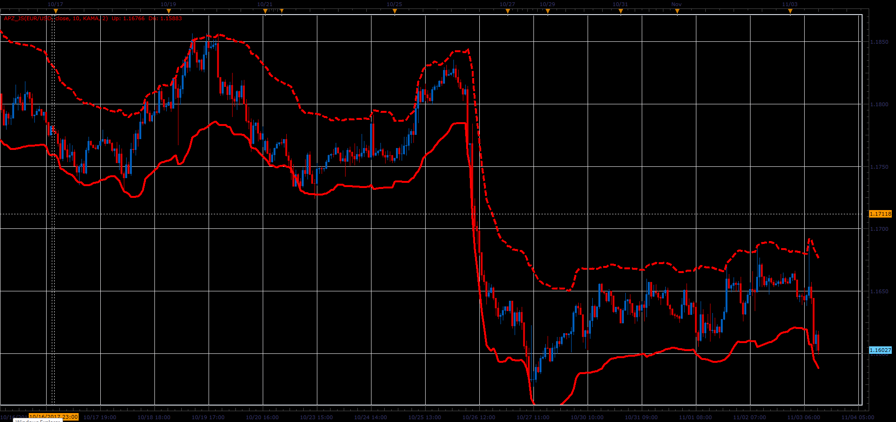

# Adaptive Price Zone

> Source: https://fxcodebase.com/code/viewtopic.php?f=48&t=65517  
> Forum: 48 · Topic 65517 · 1 post(s)

---

## Adaptive Price Zone

**Alexander.Gettinger** · Sat Jan 06, 2018 12:07 pm

Formulas:
Up = MA1+width*MA2,
Dn = MA1-width*MA2, where
MA1 = MA(Price) with [Length] number of periods and [Method] type,
MA2 = MA(Range) with [Length] number of periods and [Method] type,
Range = High-Low.

 

Download:

 [APZ_JS.jsl](files/116796/APZ_JS.jsl)
