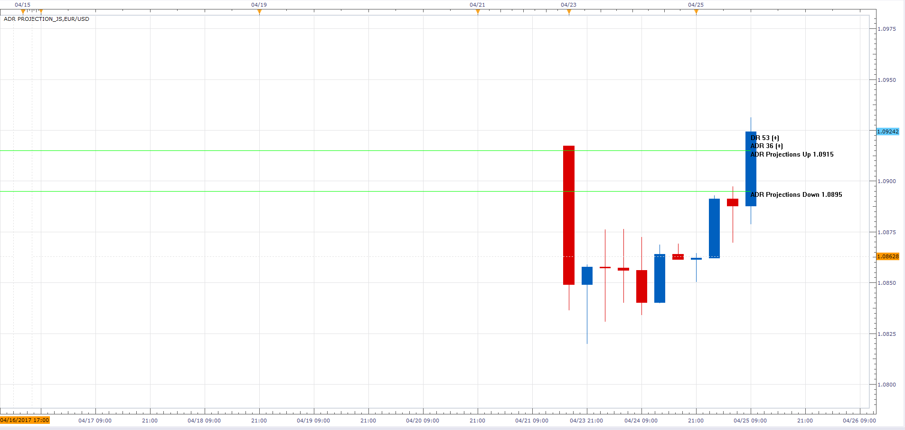

# ADR Projection

> Source: https://fxcodebase.com/code/viewtopic.php?f=48&t=64764  
> Forum: 48 · Topic 64764 · 1 post(s)

---

## ADR Projection

**Alexander.Gettinger** · Mon Jun 05, 2017 12:17 pm

ADR Projections Up = low[period] + ADR[period];
ADR Projections Down = high[period] - ADR[period];

Daily Range
DR = High[period] - Low [Period];
ADR = AVG ( DR, Period);
ATR is also supported, but is basically the same as ATR.

 

Download;

 [ADR Projection_JS.jsl](files/112775/ADR%20Projection_JS.jsl)
