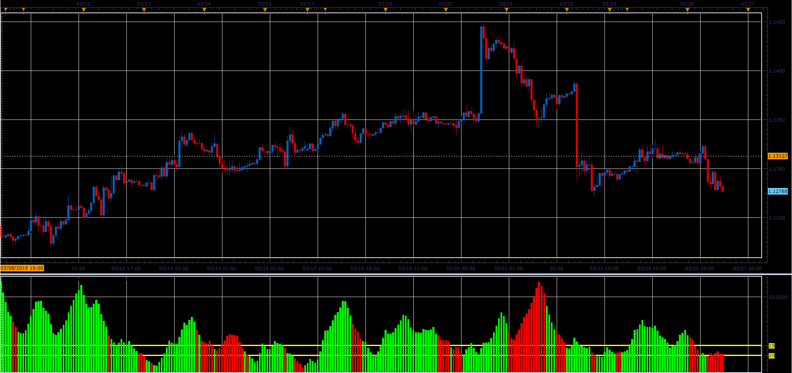

# Advanced ADX

> Source: https://fxcodebase.com/code/viewtopic.php?f=48&t=68251  
> Forum: 48 · Topic 68251 · 1 post(s)

---

## Advanced ADX

**Alexander.Gettinger** · Sat Mar 30, 2019 3:13 pm

Basically this is the ADX Bar chart.
Color Overlay use DMI.
Green
DIP> DIM
Red color
DIP <DIM

 

Download:

 [Advanced_ADX_Separate_Periods_JS.jsl](files/125471/Advanced_ADX_Separate_Periods_JS.jsl)
