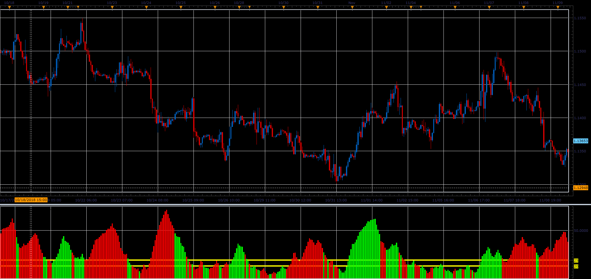

# Advanced ADX

> Source: https://fxcodebase.com/code/viewtopic.php?f=48&t=67067  
> Forum: 48 · Topic 67067 · 1 post(s)

---

## Advanced ADX

**Alexander.Gettinger** · Fri Dec 07, 2018 1:06 pm

Basically this is the ADX Bar chart.
Color Overlay use DMI.
Green
DIP> DIM
Red color
DIP <DIM

 

Download:

 [Advanced_ADX_JS.jsl](files/122576/Advanced_ADX_JS.jsl)
