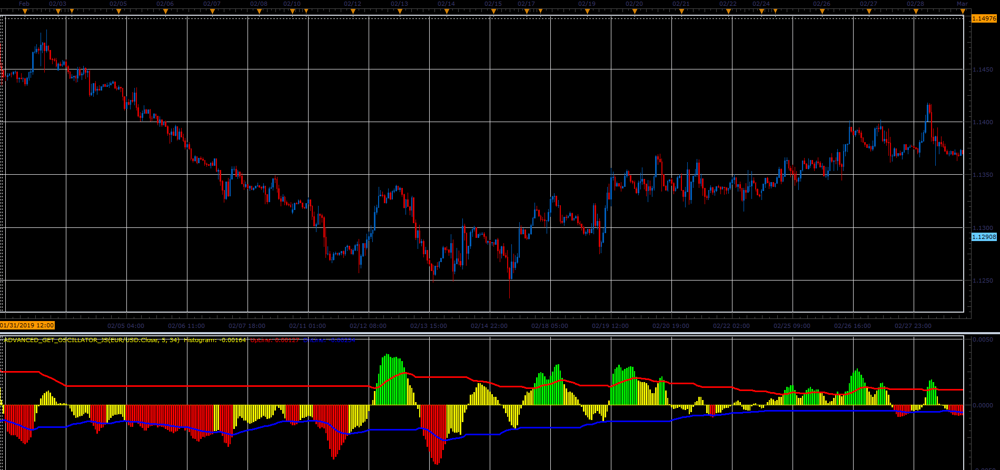

# Advanced Get Oscillator

> Source: https://fxcodebase.com/code/viewtopic.php?f=48&t=68196  
> Forum: 48 · Topic 68196 · 1 post(s)

---

## Advanced Get Oscillator

**Alexander.Gettinger** · Sat Mar 30, 2019 11:01 am

Formulas:
Histogram=MVA(FastPeriod)-MVA(SlowPeriod),
if Histogram>=0: UpLine[i]=Histogram[i]*Coeff+UpLine[i-1]*(1-Coeff), DnLine[i]=DnLine[i-1],
if Histogram<0: UpLine[i]=UpLine[i-1], DnLine[i]=Histogram[i]*Coeff+DnLine[i-1]*(1-Coeff), where
Coeff=2/39.

 

Download:

 [Advanced_Get_Oscillator_JS.jsl](files/125415/Advanced_Get_Oscillator_JS.jsl)
