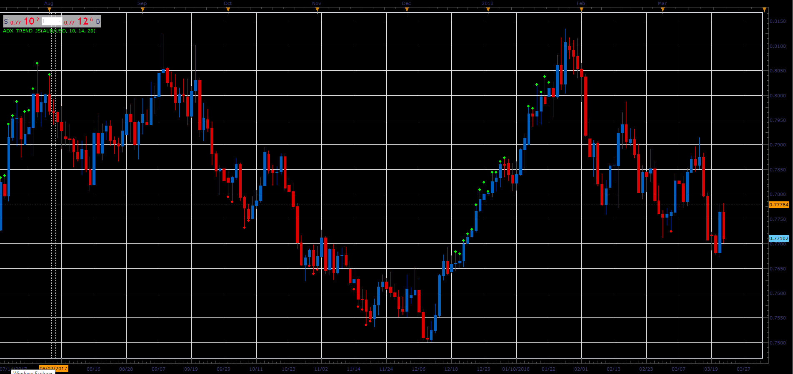

# ADX Trend indicator

> Source: https://fxcodebase.com/code/viewtopic.php?f=48&t=65898  
> Forum: 48 · Topic 65898 · 1 post(s)

---

## ADX Trend indicator

**Alexander.Gettinger** · Wed Apr 11, 2018 1:47 pm

The indicator uses ADX and DMI indicators.

The indicator draws dots if all ADX (with ADX1_Period, ADX2_Period and ADX3_Period) increase and ADX(ADX1_Period)>[Level1], ADX(ADX2_Period)>[Level2].
if (DMI+)-(DMI-)>0, indicator draws a UP dot and if (DMI+)-(DMI-)<0, indicator draws a DN dot.

 

Download:

 [ADX_Trend_JS.jsl](files/118561/ADX_Trend_JS.jsl)
