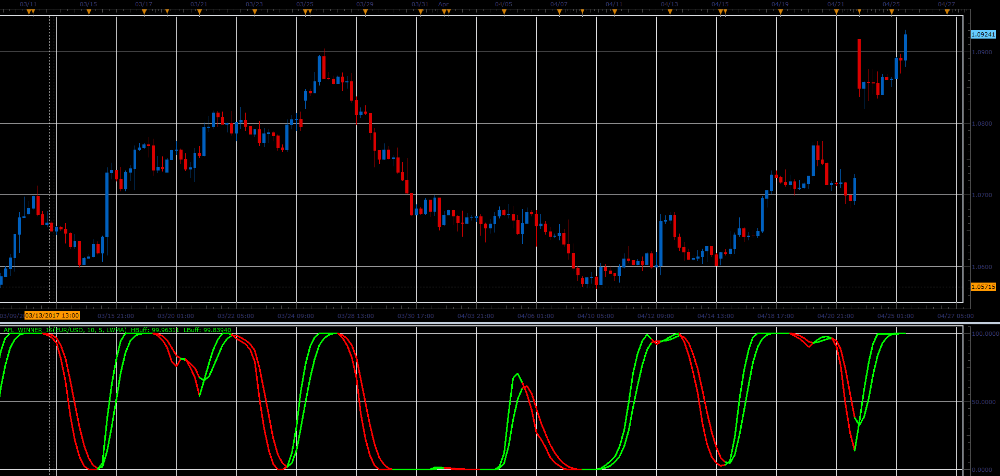

# AFL Winner oscillator

> Source: https://fxcodebase.com/code/viewtopic.php?f=48&t=64767  
> Forum: 48 · Topic 64767 · 1 post(s)

---

## AFL Winner oscillator

**Alexander.Gettinger** · Mon Jun 05, 2017 12:25 pm

Formulas:
HBuff[i]=MA(rsv),
LBuff[i]=MA(HBuff), where
rsv[i]=100*(pa[i]-min)/(max-min),
min, max - minimum and maximum values of pa in the range from (i-Periods) to i,
pa[i]=SumCost[i]/SumVolume[i],
SumCost - sum of Volume*[Weighted price] in the range from (i-Average) to i,
SumVolume - sum of Volume in the range from (i-Average) to i.

 

Download:

 [AFL_Winner_JS.jsl](files/112778/AFL_Winner_JS.jsl)
