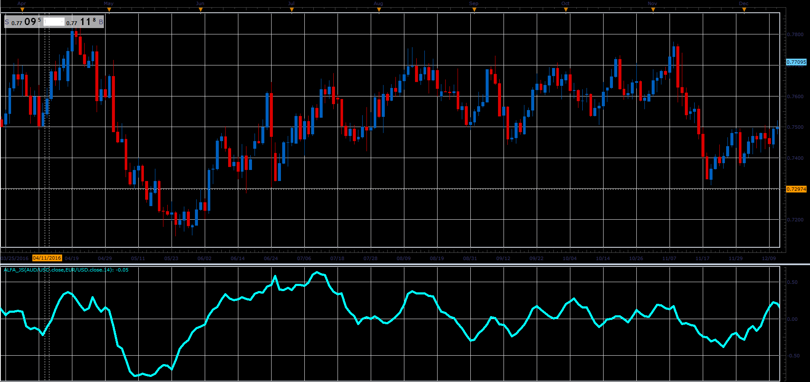

# Alpha indicator

> Source: https://fxcodebase.com/code/viewtopic.php?f=48&t=65900  
> Forum: 48 · Topic 65900 · 1 post(s)

---

## Alpha indicator

**Alexander.Gettinger** · Wed Apr 11, 2018 1:52 pm

The difference between the fair and actually expected rates of return on a stock is called the stock's alpha.

 

Download:

 [Alpha_JS.jsl](files/118563/Alpha_JS.jsl)
