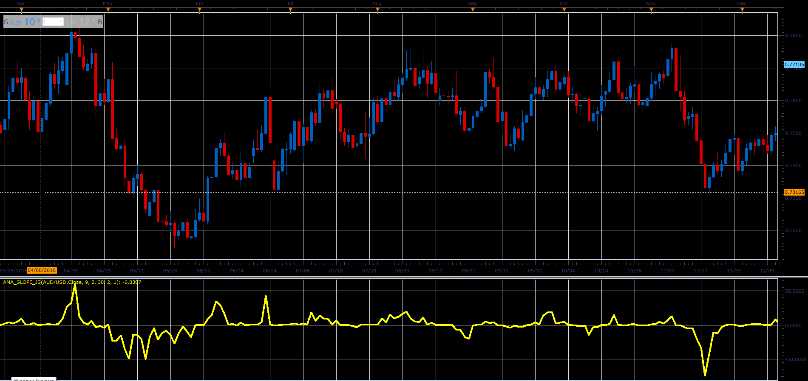

# AMA slope oscillator

> Source: https://fxcodebase.com/code/viewtopic.php?f=48&t=65901  
> Forum: 48 · Topic 65901 · 1 post(s)

---

## AMA slope oscillator

**Alexander.Gettinger** · Wed Apr 11, 2018 1:53 pm

Formulas:
AMA_Slope[i] = AMA[i]-AMA[i-1], where
AMA[i] = AMA[i-1]+SSC[i]^G*(Price[i]-AMA[i-1]),
SSC[i] = ERSC[i]+slowSC,
ERSC[i] = ER[i]*(fastSC-slowSC),
ER[i] = signal[i]/noise[i],
signal[i] = Abs(Price[i]-Price[i-AMA_Period]),
noise[i] = sum(Abs(Price[i]-Price[i-1])),
fastSC = 2/(Fast_Period+1),
slowSC = 2/(Slow_Period+1).

 

Download:

 [AMA_Slope_JS.jsl](files/118564/AMA_Slope_JS.jsl)
