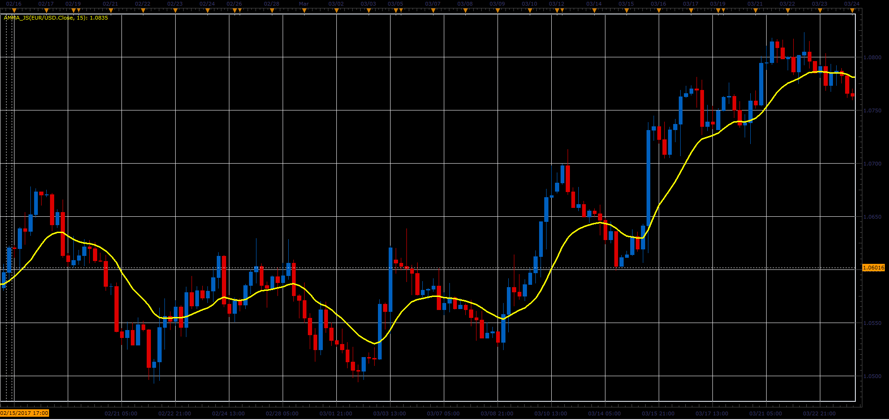

# AMMA indicator

> Source: https://fxcodebase.com/code/viewtopic.php?f=48&t=64679  
> Forum: 48 · Topic 64679 · 1 post(s)

---

## AMMA indicator

**Alexander.Gettinger** · Fri May 26, 2017 2:01 pm

Formula:
AMMA[i] = (AMMA[i-1]*(Length-2)+Price[i]+Price[i-1])/Length, where
Length - number of periods.

 

Download:

 [AMMA_JS.jsl](files/112558/AMMA_JS.jsl)
