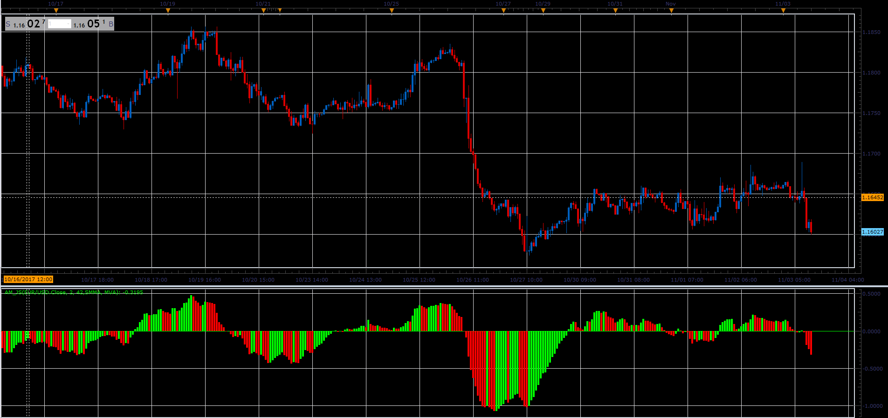

# Anchored Momentum

> Source: https://fxcodebase.com/code/viewtopic.php?f=48&t=65512  
> Forum: 48 · Topic 65512 · 1 post(s)

---

## Anchored Momentum

**Alexander.Gettinger** · Sat Jan 06, 2018 11:59 am

The formula for the calculation of the oscillator.
If you choose, you can replace the first moving average with closing price.
Anchored Momentum [period] = 100*((MA_One /MA_Two)-1);

 

Download:

 [AM_JS.jsl](files/116791/AM_JS.jsl)
