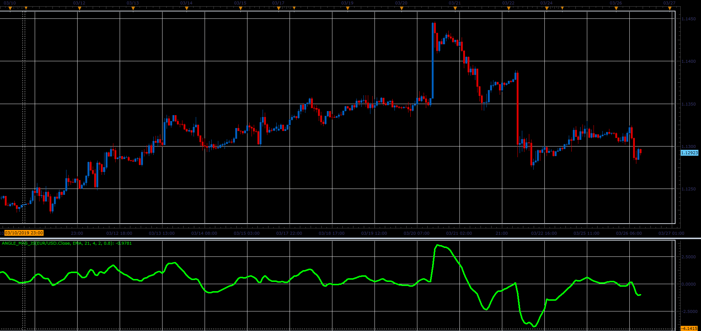

# Angle MA oscillator

> Source: https://fxcodebase.com/code/viewtopic.php?f=48&t=68198  
> Forum: 48 · Topic 68198 · 1 post(s)

---

## Angle MA oscillator

**Alexander.Gettinger** · Sat Mar 30, 2019 11:05 am

Formulas:
AngleMA[i] = ArcTan(tang[i])*VisualFactor, where
ArcTan - arc tangent,
tang[i] = incr[i]/Coeff,
incr[i] = MA(i)-MA(i-Coeff).

 

Download:

 [Angle_MAs_JS.jsl](files/125417/Angle_MAs_JS.jsl)

For this indicator must be installed Averages indicator ([viewtopic.php?f=17&t=2430](https://fxcodebase.com/code/viewtopic.php?f=17&t=2430)).
