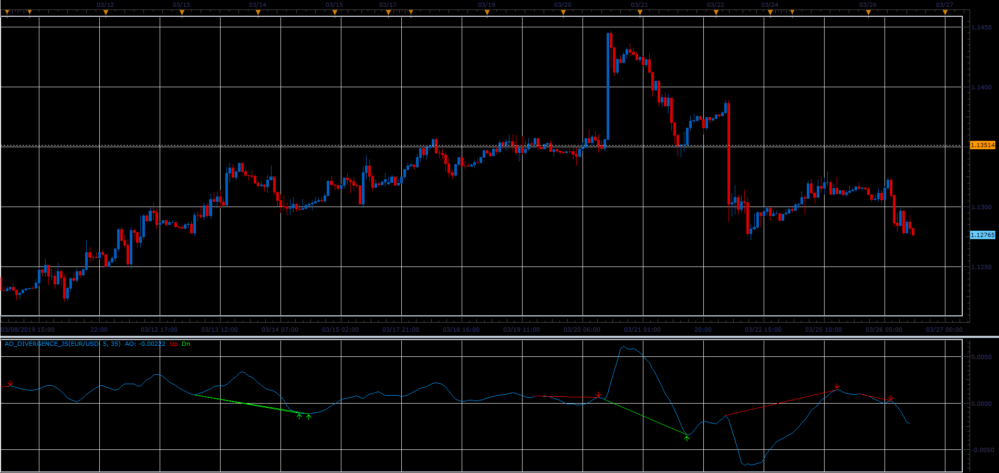

# AO divergence indicator

> Source: https://fxcodebase.com/code/viewtopic.php?f=48&t=68253  
> Forum: 48 · Topic 68253 · 6 post(s)

---

## AO divergence indicator

**Alexander.Gettinger** · Sat Mar 30, 2019 3:17 pm

Shows AO and AO divergence lines.

 

Download:

 [AO_Divergence_JS.jsl](files/125473/AO_Divergence_JS.jsl)

 [AO_Divergence_JS_with_Alert.jsl](files/125473/AO_Divergence_JS_with_Alert.jsl)

---

## Re: AO divergence indicator

**filoo7** · Wed Apr 17, 2019 2:02 pm

Hi
it's possible to add athxn alert for different types of signals (classic bullish, reversal bullish etc ...)
thx

---

## Re: AO divergence indicator

**Apprentice** · Thu Apr 18, 2019 5:21 am

What is athxn?

---

## Re: AO divergence indicator

**filoo7** · Thu Apr 18, 2019 6:02 am

my mistake
it's possible to add alert for different types of signals (classic bullish, reversal bullish etc ...)

---

## Re: AO divergence indicator

**Apprentice** · Mon Jun 17, 2019 8:01 am

Your request is added to the development list under Id Number 4732

---

## Re: AO divergence indicator

**Apprentice** · Fri Jun 28, 2019 5:50 am

AO_Divergence_JS_with_Alert.jsl added.
