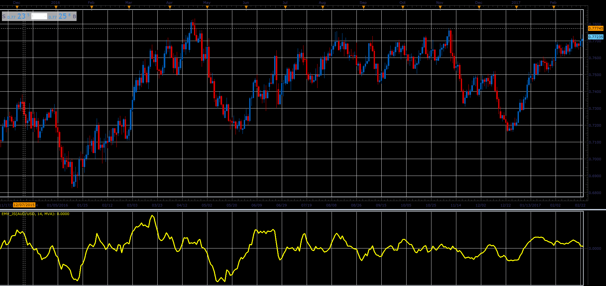

# Arm's Ease of Movement Value

> Source: https://fxcodebase.com/code/viewtopic.php?f=48&t=65994  
> Forum: 48 · Topic 65994 · 1 post(s)

---

## Arm's Ease of Movement Value

**Alexander.Gettinger** · Tue May 01, 2018 11:09 am

The Arms' Ease of Movement Value (EMV) is a momentum indicator developed by Richard W. Arms, Jr. The indicator takes into account both volume and price changes to quantify the ease (or difficulty) of price movements.

EMV = (((CurrHigh + CurrLow)/2) - ((PrevHigh + PrevLow)/2)) / ((CurrVolume)/( CurrHigh - CurrLow)) ;

 

Download:

 [emv_JS.jsl](files/118920/emv_JS.jsl)

For this oscillator must be installed Averages indicator ([viewtopic.php?f=17&t=2430](https://fxcodebase.com/code/viewtopic.php?f=17&t=2430)).
