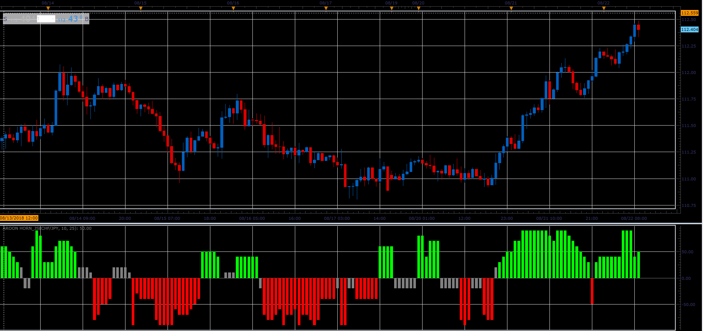

# Aroon Horn

> Source: https://fxcodebase.com/code/viewtopic.php?f=48&t=66955  
> Forum: 48 · Topic 66955 · 1 post(s)

---

## Aroon Horn

**Alexander.Gettinger** · Sat Nov 24, 2018 11:09 am

Formula:
AH = 10*(Up-Dn)/Length, where
Up[i] = 100*(Length-MaxBar+i)/Length,
Dn[i] = 100*(Length-MinBar+i)/Length,
MaxBar, MinBar - positions of maximum and minimum prices at range from [i-Length+1] to [i].

 

Download:

 [Aroon Horn_JS.jsl](files/122283/Aroon%20Horn_JS.jsl)
