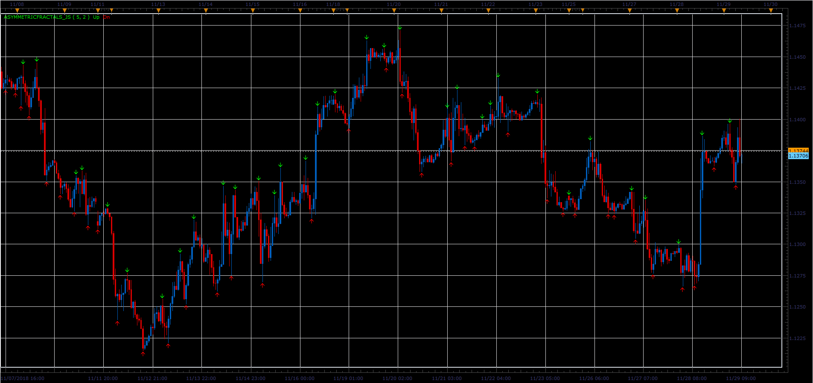

# Asymmetric fractals

> Source: https://fxcodebase.com/code/viewtopic.php?f=48&t=67072  
> Forum: 48 · Topic 67072 · 1 post(s)

---

## Asymmetric fractals

**Alexander.Gettinger** · Fri Dec 07, 2018 1:22 pm

The indicator similar to Fractals, but number of bars before and after the fractal specified separately.

 

Download:

 [AsymmetricFractals_JS.jsl](files/122581/AsymmetricFractals_JS.jsl)
