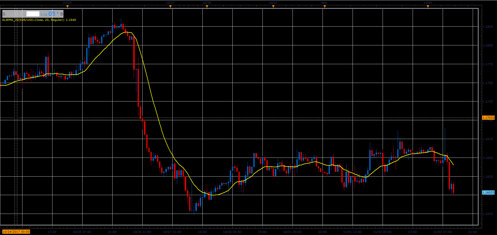

# Asymmetric Linear Weighted Moving Average

> Source: https://fxcodebase.com/code/viewtopic.php?f=48&t=65511  
> Forum: 48 · Topic 65511 · 1 post(s)

---

## Asymmetric Linear Weighted Moving Average

**Alexander.Gettinger** · Sat Jan 06, 2018 11:57 am

The indicator has three modes Regular, Inverse, Asymmetric.

Regular- Behaves as an ordinary LWMA.
Most of the weight is on the last period.

Inverse
Most of the weight is on the first period.

Asymmetric
Most of the weight is on Middle of observed period.
Beginning and end sections are less represented.

Inverse Asymmetric
Most of the weight is Beginning and end of observed period.
Middle section is less represented.

 

Download:

 [ALWMA_JS.jsl](files/116790/ALWMA_JS.jsl)
