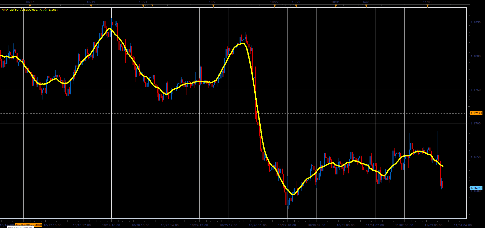

# Asymmetric Moving Average

> Source: https://fxcodebase.com/code/viewtopic.php?f=48&t=65513  
> Forum: 48 · Topic 65513 · 1 post(s)

---

## Asymmetric Moving Average

**Alexander.Gettinger** · Sat Jan 06, 2018 12:01 pm

Asymmetric Moving Average, in which, the last period has a weight of 50 percentage + one period.
For example, if we have a 10 periods Asymmetric moving average, the calculation would be.
[(17 + 18 + 19 + 18 + 17 )+( 17 + 17 + 17 + 17 + 17)] / 10 = 17.4

 

Download:

 [AMA_JS.jsl](files/116792/AMA_JS.jsl)
