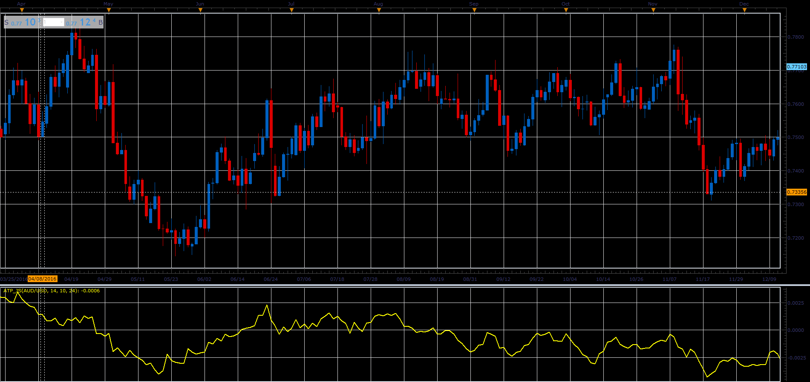

# Asymmetric Trend Pressure

> Source: https://fxcodebase.com/code/viewtopic.php?f=48&t=65908  
> Forum: 48 · Topic 65908 · 1 post(s)

---

## Asymmetric Trend Pressure

**Alexander.Gettinger** · Wed Apr 11, 2018 2:02 pm

It basically compares the Up and Down pressure
for the last, N candles in the direction of the trend,
and last N candle in the opposite direction from current trends.

Allows you to define a separate trend, and Reversal Period.
If you are using Smaller Reversal Period this will Result with in earlier signals.

 

Download:

 [ATP_JS.jsl](files/118571/ATP_JS.jsl)
