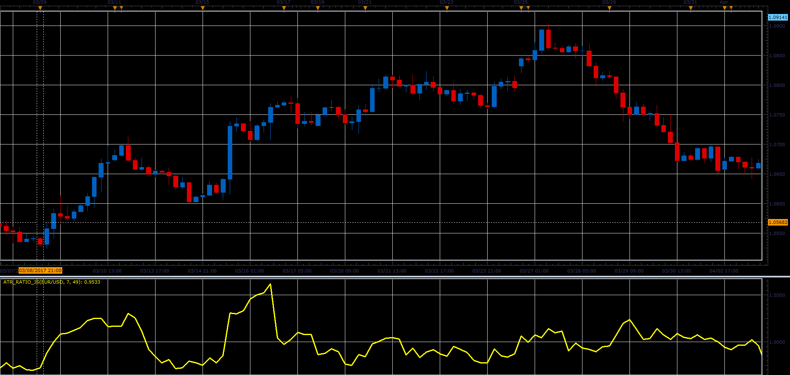

# ATR ratio

> Source: https://fxcodebase.com/code/viewtopic.php?f=48&t=64683  
> Forum: 48 · Topic 64683 · 1 post(s)

---

## ATR ratio

**Alexander.Gettinger** · Fri May 26, 2017 2:11 pm

Formula:
ATR ratio = ATR_S/ATR_L, where
ATR_S - Average True Range with [ShortPeriod] number of periods,
ATR_L - Average True Range with [LongPeriod] number of periods.

 

Download:

 [ATR_Ratio_JS.jsl](files/112562/ATR_Ratio_JS.jsl)
