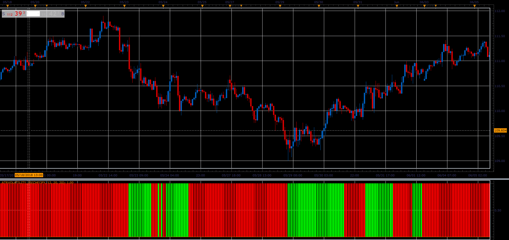

# Atr Volatility

> Source: https://fxcodebase.com/code/viewtopic.php?f=48&t=66956  
> Forum: 48 · Topic 66956 · 1 post(s)

---

## Atr Volatility

**Alexander.Gettinger** · Sat Nov 24, 2018 11:10 am

The indicator shows when the ATR value is higher / lower than the default, in pips.
I added the percentage mode.
Shows the position of the ATR values ​​within the range of ATR values
From minimum to maximum, it is calculated for all on on Chart data.

 

Download:

 [AtrVolatility_JS.jsl](files/122284/AtrVolatility_JS.jsl)
