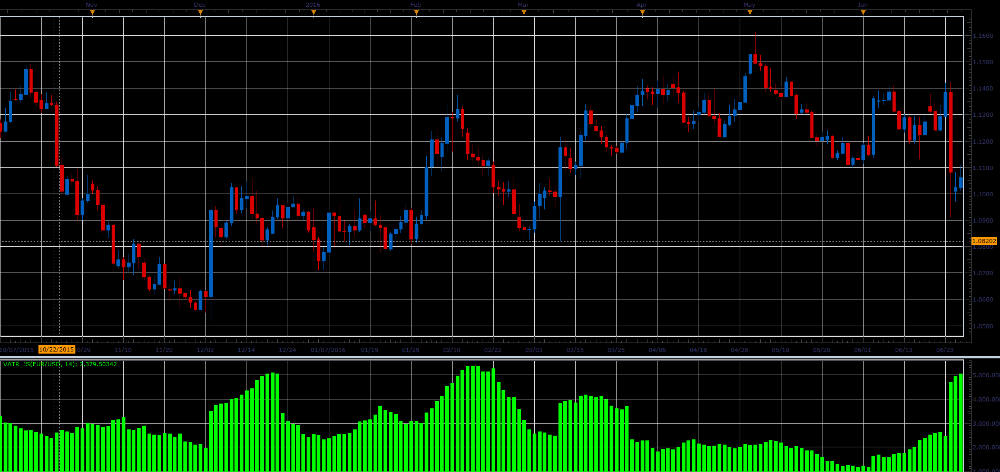

# ATR with volume (VATR)

> Source: https://fxcodebase.com/code/viewtopic.php?f=48&t=65301  
> Forum: 48 · Topic 65301 · 1 post(s)

---

## ATR with volume (VATR)

**Alexander.Gettinger** · Sat Oct 28, 2017 2:31 pm

Formulas:
VATR=Average(TR[i]*Volume[i]), where
TR - true range, TR[i]=Max(High[i]-Low[i], High[i]-Close[i-1], Close[i-1]-Low[i]).

 

Download:

 [VATR_JS.jsl](files/115726/VATR_JS.jsl)
