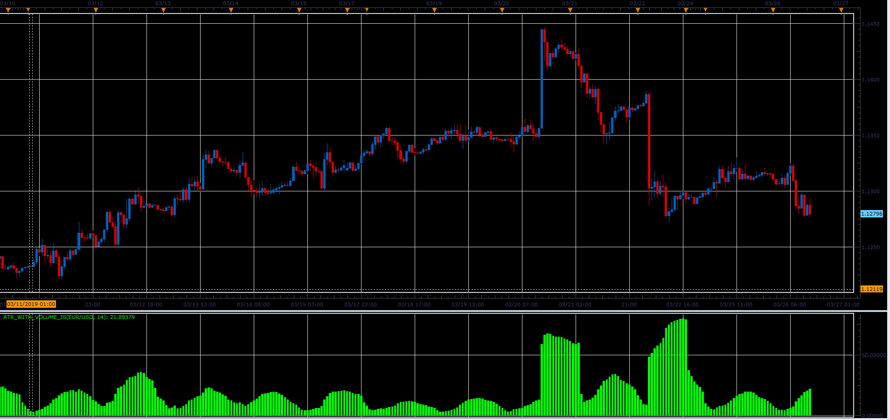

# ATR with volume

> Source: https://fxcodebase.com/code/viewtopic.php?f=48&t=68199  
> Forum: 48 · Topic 68199 · 1 post(s)

---

## ATR with volume

**Alexander.Gettinger** · Sat Mar 30, 2019 11:07 am

Formulas:
ATR with Volume=Average(TR[i]*Volume[i]), where
TR - true range, TR[i]=Max(High[i]-Low[i], High[i]-Close[i-1], Close[i-1]-Low[i]).

 

Download:

 [ATR_with_Volume_JS.jsl](files/125418/ATR_with_Volume_JS.jsl)
