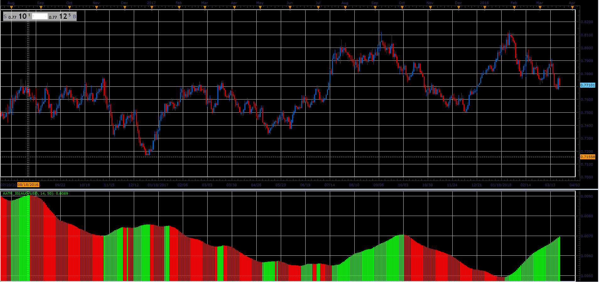

# Average Average True Range

> Source: https://fxcodebase.com/code/viewtopic.php?f=48&t=65895  
> Forum: 48 · Topic 65895 · 1 post(s)

---

## Average Average True Range

**Alexander.Gettinger** · Wed Apr 11, 2018 1:44 pm

Formula:
AATR = MVA(ATR) with [MA_Length] number of periods, where
ATR - average true range with [ATR_Length] number of periods.

 

Download:

 [AATR_JS.jsl](files/118558/AATR_JS.jsl)
